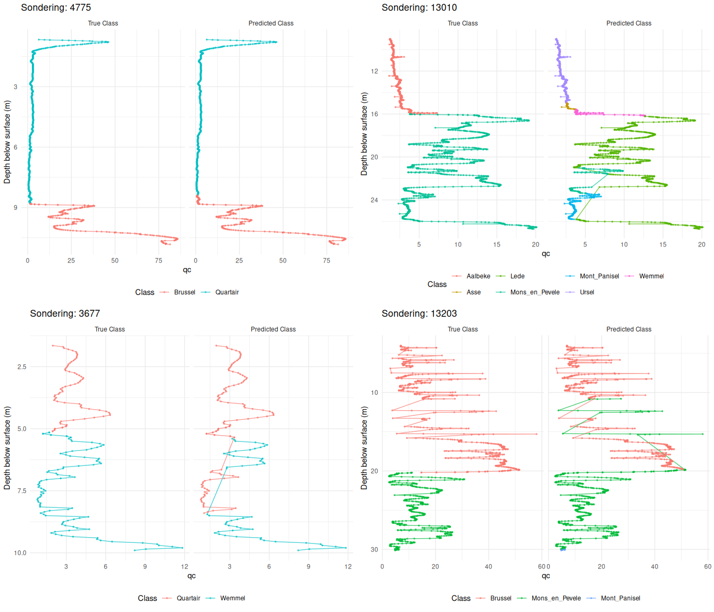

Comparing Results with predicted
================

## Load Data

``` r
# Load the Random Forest predictions
# Using here() to locate the file relative to project root
results_df <- read_csv(here("results/predictions_python_models/debug_merged_rf.csv"))

# Preview data
head(results_df)
```

    ## # A tibble: 6 × 21
    ##   sondering_id index pkey_sondering                  sondeernummer      x      y
    ##          <dbl> <dbl> <chr>                           <chr>          <dbl>  <dbl>
    ## 1          315  2832 https://www.dov.vlaanderen.be/… GEO-97/127-S3 1.53e5 1.82e5
    ## 2          315  2833 https://www.dov.vlaanderen.be/… GEO-97/127-S3 1.53e5 1.82e5
    ## 3          315  2834 https://www.dov.vlaanderen.be/… GEO-97/127-S3 1.53e5 1.82e5
    ## 4          315  2835 https://www.dov.vlaanderen.be/… GEO-97/127-S3 1.53e5 1.82e5
    ## 5          315  2836 https://www.dov.vlaanderen.be/… GEO-97/127-S3 1.53e5 1.82e5
    ## 6          315  2837 https://www.dov.vlaanderen.be/… GEO-97/127-S3 1.53e5 1.82e5
    ## # ℹ 15 more variables: start_sondering_mtaw <dbl>, diepte_sondering_tot <dbl>,
    ## #   diepte <dbl>, diepte_mtaw <dbl>, qc <dbl>, fs <dbl>, qtn <dbl>, rf <dbl>,
    ## #   fr <dbl>, icn <dbl>, sbt <dbl>, ksbt <dbl>, lithostrat_id <chr>,
    ## #   depth_bin <chr>, pred_class <chr>

## Plotting Function

``` r
plot_cpt_series <- function(data,
                            depth_col = "diepte",
                            value_col = "qc",
                            color_var = "lithostrat_id",
                            compare_with = NULL, # New argument for comparison
                            group_var = NULL,
                            facet_var = "sondering_id",
                            title = NULL,
                            depth_label = "Depth below surface (m)",
                            value_label = NULL,
                            ncol_facet = 3,
                            log_value = FALSE,
                            reverse_depth = TRUE,
                            flip_coords = TRUE,
                            alpha_line = 0.7,
                            alpha_point = 0.6,
                            point_size = 0.6,
                            legend_position = "bottom") {
  
  # --- Modification for Comparison ---
  # If compare_with is provided, we reshape the data to plot side-by-side
  if (!is.null(compare_with)) {
    # Check if columns exist
    if (!compare_with %in% names(data)) stop(paste("Column", compare_with, "not found in data"))
    if (!color_var %in% names(data)) stop(paste("Column", color_var, "not found in data"))
    
    # Pivot longer to create a single column for the class value and a type column
    # We use . prefix to avoid name collisions
    data <- data %>%
      pivot_longer(cols = c(all_of(color_var), all_of(compare_with)),
                   names_to = ".classification_type",
                   values_to = ".class_value") %>%
      mutate(.classification_type = factor(.classification_type, 
                                           levels = c(color_var, compare_with),
                                           labels = c("True Class", "Predicted Class")))
    
    # Override the color and facet variables to use the new reshaped columns
    color_var <- ".class_value"
    facet_var <- ".classification_type"
  }
  # -----------------------------------

  depth_sym <- rlang::ensym(depth_col)
  value_sym <- rlang::ensym(value_col)
  
  color_sym <- if (is.null(color_var)) {
    NULL
  } else {
    rlang::ensym(color_var)
  }
  
  group_sym <- if (is.null(group_var) && !is.null(color_var)) {
    rlang::ensym(color_var)
  } else if (is.null(group_var)) {
    rlang::ensym(facet_var)
  } else {
    rlang::ensym(group_var)
  }
  
  value_label <- value_label %||% value_col

  p <- ggplot(data, aes(x = !!depth_sym, y = !!value_sym)) +
    geom_line(aes(group = interaction(!!rlang::enquo(group_sym))), alpha = alpha_line) +
    geom_point(aes(group = interaction(!!rlang::enquo(group_sym))), size = point_size, alpha = alpha_point)

  if (!is.null(color_sym)) {
    p <- p + aes(color = factor(!!color_sym))
  }

  if (log_value) {
    p <- p + scale_y_log10()
  }
  if (reverse_depth) {
    p <- p + scale_x_reverse()
  }
  if (flip_coords) {
    p <- p + coord_flip()
  }

  p +
    facet_wrap(stats::as.formula(paste("~", facet_var)), ncol = ncol_facet) +
    labs(
      title = title %||% sprintf("CPT Profiles (%s vs depth)", value_col),
      x = depth_label,
      y = value_label,
      color = "Class"
    ) +
    theme_minimal() +
    theme(legend.position = legend_position)
}
```

## Generate Comparison Plots

``` r
# 1. Select 4 random sondering_ids
set.seed(42) # Ensure reproducibility
valid_ids <- unique(results_df$sondering_id)
selected_ids <- sample(valid_ids, min(4, length(valid_ids)))

print(paste("Selected IDs:", paste(selected_ids, collapse = ", ")))
```

    ## [1] "Selected IDs: 4775, 13010, 3677, 13203"

``` r
# 2. Generate individual plots
plot_list <- list()

for (id in selected_ids) {
  # Filter data for the current ID
  id_data <- results_df %>% filter(sondering_id == id)
  
  # Create the plot using the modified function
  # We compare "lithostrat_id" (True) with "pred_class" (Predicted)
  p <- plot_cpt_series(
    data = id_data,
    value_col = "qc",             # Plotting Cone Resistance
    color_var = "lithostrat_id",  # Original True Class
    compare_with = "pred_class",  # Predicted Class to compare
    title = paste("Sondering:", id),
    ncol_facet = 2                # Display True/Pred side-by-side
  )
  
  plot_list[[as.character(id)]] <- p
}

# 3. Arrange the 4 plots in a grid
# We use grid.arrange to combine the separate ggplot objects
grid.arrange(grobs = plot_list, ncol = 2)
```

<!-- -->
