# Initial Data Exploration


### Project Folder google drive

- [Project Data Science - Year 2 - UHasselt MSc - Google
  Drive](https://drive.google.com/drive/folders/1zF4BmxsynoA-PJ4ole8YZemfu0R3WHpG?usp=drive_link)

### Data dictionary for Cone Penetration Test use case

- Quartair soils in the Brussels region

- **“sondeernummer”**: unique identification number;

- **“(x,y)”**: coordinates in Lambert 72 projection;

- **“Starthoogte sondering”**: height above sea level of the CPT start
  point;

- **“Einddiepte sondering”**: final depth of the CPT measured relative
  to surface level;

- **“diepte”**: depth relative to surface level in meters

- **“diepte_mtaw”**: height above sea level in meters

- **“qc”**: measurement of the resistance of the soil to the penetration
  of the cone tip. Measurement unit is MPa or psi;

- **“fs”**: measurement of the resistance between the soil and the
  friction sleeve of the CPT tool. Measurement unit is kPa or psi;

- **“Fr”**: friction ratio calculated from qc and fs;

- **“qtn”**: normalized qc accounting for pore water pressure;

- **“Frn”**: normalized friction ratio accounting for pore water
  pressure;

- **“icn”**: ‘soil behaviour type index’ based on normalized qc and rf;

- **“sbt”**: ‘Soil behaviour Type klasse’ based on icn intervals from
  the literature. Integer number between 1 and 9;

- **“ksbt”**: estimated hydraulic conductivity derived from icn through
  empirical correlations;

- **“lithostrat_id”**: lithostratigraphic unit. This is the label we
  want to determine.

- how the model will handle new soil types it was not trained on

- Continuous learning to adapt to new data

- A time series usually have noise denoise

- goal is to find if we can given

- domain knowledge

- How to handle rare classes.

- Distribution

- Apart from CPT data what type of other data/knowledge do the
  geological experts use for soil type classification

- IN the CPT data what signals/features do they look at to be able to
  know a soil type. How do they know that a transition occurs at given
  point , ie do they look at the whole series from soldering id or each
  soil type has special series features that an expert will know by
  looking. Do knew layers soil type tend to have low CPT values etc

- How to handle rare classes, What are this soiltype communicating to a
  geotechnician

- If a good model is found, do VETO have plans/would want this to have a
  continuos learning capability. ie by adding labels of pre labelled
  data.

- Geological domain knowledge from survey data , homogeneous
  signal/heterogeneous signal. Sharp boundarys vs smooth transitions

- Segmentation, multi instance learning

- hidden markov model

- [Introduction to Cone Penetration
  Testing](https://www.ags.org.uk/2022/09/introduction-to-cone-penetration-testing/)

- [Robertson](https://www.cpt-robertson.com/PublicationsPDF/Robertson%20Updated%20SBT%20CGJ%202016.pdf)

- first define soil types using known cone penetration metrics then see
  which soil lithostart correspond to this then do the prediction

### Belgium-specific CPT/Lithostrat References

- **Rogiers et al. 2017 (PLOS ONE)** — shows **automated lithostrat
  mapping from CPT SBT** on a large dataset in **northern Belgium**;
  compares SBT-based modeling vs unsupervised/literature charts and
  reports efficiency + accuracy gains.
  ([PLOS](https://journals.plos.org/plosone/article?id=10.1371%2Fjournal.pone.0176656))

- **Deckers & Goolaerts 2022 (Geologica Belgica)** — **CPT
  characterization of Middle–Upper Miocene** near **Antwerp Intl.
  Airport** (Berchem Fm: **Kiel & Antwerpen mbrs**); documents typical
  qc/Rf expressions and regional correlations.
  ([popups.uliege.be](https://popups.uliege.be/1374-8505/index.php?id=6999))

- **Schiltz 2020 (Geologica Belgica)** — **NE Belgium (≈60 km²)** case;
  proposes an **informal stratigraphy from CPT signals** and discusses
  which CPT-derived patterns distinguish units.
  ([popups.uliege.be](https://popups.uliege.be/1374-8505/index.php?id=6668&lang=en))

- **DOV Vlaanderen – Sonderingen** — official Flemish **definitions &
  measurement details** (qc, fs, **Rf**, u₂ optional; spacing,
  acquisition); aligns your variables with the **DOV data model**.
  ([Databank Ondergrond
  Vlaanderen](https://www.dov.vlaanderen.be/page/sonderingen))

- **NCS 2022 Excursion Guide (Neogene of N Belgium)** — regional
  context; notes **recent improvements in CPT-based correlations** for
  Antwerp-area units; useful when mapping CPT patterns to named
  formations. ([Databank Ondergrond
  Vlaanderen](https://dov.vlaanderen.be/sites/default/files/pfiles_files/NCS2022_ExcursionGuide.pdf))

- **Robertson CPT guides (SBT/qtn–Fr)** — the **standard
  charts/updates** underpinning SBT interpretation used in Belgian work;
  keep handy for **qₙ, qc, Rf** mapping. ([CPT
  Robertson](https://www.cpt-robertson.com/PublicationsPDF/2-56%20RobSBT.pdf))

- **pydov (DOV client) notebooks** — practical examples to **query CPTs
  by bbox/formation**, fetch profiles, and assemble **median qc/Rf** by
  depth for template building.
  ([Pydov](https://pydov.readthedocs.io/en/stable/notebooks/search_sonderingen.html))

- data management plan

- not all information to start implementing

- relation database; tables

- Preprocessing steps, cleaning, filtering, feature engineering: Talk
  this to the client; works equally good

- minimal viable product (MVP)

- derivative features, interactions, kNN, PCA, tsne, likelihood of
  layers, then which specific layers

- Sliding window approach, Modelling approach, 80% likelihood of this.
  Depth, geographical location, spatial correlation, depth profile,

- sequence, temporal patterns,

- multi instance learning, transition period, transient periods

- predict transition periods

- ensemble models, xgboost, lightgbm, catboost

- missing layers - imputation, knn imputation, mice imputation

- learn characteristics of missing layers

- markov models??

- look at the sequence of layer transitions

- geological domain knowledge, homogeneous signal/heterogeneous signal.
  Sharp boundaries vs smooth transitions

- first maybe group similar layers together, then predict the groups,
  then within the groups predict the specific layers

- handle removed layers using geotechnical information on sequentiality

``` r
library(tidyverse)
library(data.table)
library(arrow)
library(here)
library(xgboost)
library(knitr)
library(zoo)
main_folder <- "year2/Project_Data_Science/project"
data_folder <- here(main_folder, "data")
results_folder <- here(main_folder, "results")
cpt_df <- read_parquet(
  paste(
    data_folder,
    "vw_cpt_brussels_params_completeset_20250318_remapped.parquet",
    sep = "/"
  )
)
setDT(cpt_df)
```

- head

``` r
# filter of na in lithostrat_id
lithostrat_missing_df <- cpt_df[is.na(lithostrat_id)]
cpt_df <- cpt_df[!is.na(lithostrat_id)]
head(cpt_df) %>% kable()
```

| sondering_id | index | pkey_sondering | sondeernummer | x | y | start_sondering_mtaw | diepte_sondering_tot | diepte | diepte_mtaw | qc | fs | qtn | rf | fr | icn | sbt | ksbt | lithostrat_id |
|---:|---:|:---|:---|---:|---:|---:|---:|---:|---:|---:|---:|---:|---:|---:|---:|---:|---:|:---|
| 314 | 2593 | https://www.dov.vlaanderen.be/data/sondering/1998-005043 | GEO-97/127-S2 | 153278.2 | 181734.6 | 15.26 | 25.4 | 1.6 | 13.66 | 1.17 | 0.035 | 35.89400 | 2.991453 | 3.058371 | 2.564340 | 5 | 1e-07 | Quartair |
| 314 | 2594 | https://www.dov.vlaanderen.be/data/sondering/1998-005043 | GEO-97/127-S2 | 153278.2 | 181734.6 | 15.26 | 25.4 | 1.7 | 13.56 | 1.57 | 0.033 | 42.56232 | 2.101911 | 2.138968 | 2.406724 | 5 | 4e-07 | Quartair |
| 314 | 2595 | https://www.dov.vlaanderen.be/data/sondering/1998-005043 | GEO-97/127-S2 | 153278.2 | 181734.6 | 15.26 | 25.4 | 1.8 | 13.46 | 1.43 | 0.036 | 38.53699 | 2.517482 | 2.569226 | 2.491219 | 5 | 2e-07 | Quartair |
| 314 | 2596 | https://www.dov.vlaanderen.be/data/sondering/1998-005043 | GEO-97/127-S2 | 153278.2 | 181734.6 | 15.26 | 25.4 | 1.9 | 13.36 | 0.50 | 0.024 | 15.67850 | 4.800000 | 5.111166 | 2.982185 | 3 | 0e+00 | Quartair |
| 314 | 2597 | https://www.dov.vlaanderen.be/data/sondering/1998-005043 | GEO-97/127-S2 | 153278.2 | 181734.6 | 15.26 | 25.4 | 2.0 | 13.26 | 1.33 | 0.023 | 33.20312 | 1.729323 | 1.772110 | 2.440158 | 5 | 3e-07 | Quartair |
| 314 | 2598 | https://www.dov.vlaanderen.be/data/sondering/1998-005043 | GEO-97/127-S2 | 153278.2 | 181734.6 | 15.26 | 25.4 | 2.1 | 13.16 | 1.40 | 0.033 | 35.28872 | 2.357143 | 2.415509 | 2.503022 | 5 | 2e-07 | Quartair |

``` r
# read file from data_folder
lithostrat_label_order <- fread(
  paste(
    data_folder,
    "Copy of lithostrat_label_order - lithostrat_label_order.csv",
    sep = "/"
  )
)
kable(lithostrat_label_order)
```

| idnr | lithostrat_unit | label_certainty | cpt characteristics known by interpreters | V5 |
|---:|:---|:---|:---|:---|
| 1001 | Quartair | low | huge qc range is possible from very low to \>20 Mpa and a Rf ranging from \<1 to \>6% |  |
| 1002 | Diest | medium | qc highly variable around 10 or more MPa and a Rf around 3% but also very variable |  |
| 1003 | Bolderberg | medium | The base of this deposit often contains purple clay with glauconite, characterised by high Rf values and low qc values. Upwards, the profile gradually progresses to pure, mica-rich sand, with Rf decreasing to values less than 2% and qc values increasing to more than 5 MPa. |  |
| 1005 | Sint_Huibrechts_Hern | medium | low qc around 2-4 Mpa and Rf variabel around 2-4% most of the time |  |
| 1007 | Ursel | high | the qc there drops below 2 MPa and an Rf rising to over 4%, typical of more fatty clay |  |
| 1008 | Asse | high | At the transition from the Wemmel Member to the Asse Member, the qc dips below 4 MPa |  |
| 1009 | Wemmel | high | The qc is usually situated between 5 and 10 MPa. Locally high peaks in Rf up to 4% can be explained by the glauconite-rich character. |  |
| 1010 | Lede | high | an average slightly lower and more stable qc value of around 10 to 15 MPa and an Rf of 1 to 3% compared to the Brussels Formation. Cementation, however, provides qc peaks of up to 40 MPa. |  |
| 1011 | Brussel | high | wide variability in cone resistance (qc) and friction ratio (Rf). moderate to high qc values (10–30+ MPa), depending on the degree of cementation; Rf values are typically low (around 1% or less), consistent with dense, sandy materials. Local spikes in qc are common, caused by cemented or calcareous sandstone interbeds, |  |
| 1012 | Merelbeke | very high | typically low qc values (\<2 MPa) and a characteristically high Rf (\>5%). |  |
| 1013 | Kwatrecht | high | interpretation is mainly based on absence of high qc peaks (no cementations) and Rf around 2 and 3%, not higher as for instance upper Merelbeke clay deposit |  |
| 1014 | Mont_Panisel | high | qc value generally ranging between 5 and 15 MPa, with local peaks above 20 MPa where cemented zones occur. Towards the south, facies change is clearly visible within the member, with stone banks gradually disappearing. |  |
| 1015 | Aalbeke | very high | typical clay deposit and easily recognised by its low qc (around 4MPa and below) that typically remains stable and often decreases further towards the top along with an Rf always above 3%. |  |
| 1016 | Mons_en_Pevele | very high | highly variable and high qc (\>15 MPa) with peaks to over 40MPa at (cemented) nummulite-rich intervals. | rf is variabel |

``` r
soldering_id_with_litho_missing <- unique(lithostrat_missing_df$sondering_id)
# without lithostrat_id missing
soldering_id_with_litho <- unique(cpt_df$sondering_id)

id_to_check <- 493
common_soldering_id <- intersect(soldering_id_with_litho_missing, soldering_id_with_litho)
soldering_315_df <- cpt_df[sondering_id == id_to_check]
soldering_315_df_without_litho <- lithostrat_missing_df[sondering_id == id_to_check]
```

``` r
cpt_df[, .N, by = sondering_id][order(-N)]
```

         sondering_id     N
                <int> <int>
      1:         4617  3141
      2:         4647  3013
      3:        14013  2938
      4:        13113  2839
      5:         4643  2787
     ---                   
    238:         3679    46
    239:         3682    33
    240:          493    27
    241:         4873    21
    242:          552    19

``` r
cpt_df[, .(unique_drillings = uniqueN(sondering_id))]
```

       unique_drillings
                  <int>
    1:              242

``` r
# number of obs per soldering id
cpt_df[, no_obs := .N, by = sondering_id]
obs <- cpt_df[, .(
  min_obs = min(no_obs),
  max_obs = max(no_obs),
  mean_obs = mean(no_obs),
  median_obs = median(no_obs)
)]

kable(obs)
```

| min_obs | max_obs | mean_obs | median_obs |
|--------:|--------:|---------:|-----------:|
|      19 |    3141 | 1485.379 |       1479 |

- find unique drillings then map

``` r
unique_drillings <- cpt_df |>
  unique(by = "sondering_id")

## convert lambert to plot to plot with geom_sf
library(sf)
library(ggspatial)
library(ggrepel)


unique_drillings[, lithostrat_id_aval := ifelse(is.na(lithostrat_id), "missing", "available")]
unique_drillings_sf <- st_as_sf(unique_drillings,
  coords = c("x", "y"), crs = 31370
) |>
  st_transform(crs = 4326)

head(unique_drillings_sf) %>% kable()
```

| sondering_id | index | pkey_sondering | sondeernummer | start_sondering_mtaw | diepte_sondering_tot | diepte | diepte_mtaw | qc | fs | qtn | rf | fr | icn | sbt | ksbt | lithostrat_id | no_obs | lithostrat_id_aval | geometry |
|---:|---:|:---|:---|---:|---:|---:|---:|---:|---:|---:|---:|---:|---:|---:|---:|:---|---:|:---|:---|
| 314 | 2593 | https://www.dov.vlaanderen.be/data/sondering/1998-005043 | GEO-97/127-S2 | 15.26 | 25.4 | 1.6 | 13.66 | 1.17 | 0.035 | 35.89400 | 2.9914530 | 3.0583712 | 2.564340 | 5 | 1.00e-07 | Quartair | 239 | available | POINT (4.4154 50.94589) |
| 315 | 2832 | https://www.dov.vlaanderen.be/data/sondering/1998-005044 | GEO-97/127-S3 | 15.36 | 25.4 | 1.4 | 13.96 | 1.36 | 0.032 | 43.37004 | 2.3529412 | 2.3923445 | 2.432166 | 5 | 4.00e-07 | Quartair | 240 | available | POINT (4.415635 50.94579) |
| 316 | 3073 | https://www.dov.vlaanderen.be/data/sondering/1998-005045 | GEO-97/127-S4 | 15.44 | 26.4 | 1.1 | 14.34 | 1.12 | 0.050 | 56.62296 | 4.4642857 | 4.5384971 | 2.543799 | 5 | 2.00e-07 | Quartair | 254 | available | POINT (4.415901 50.94573) |
| 319 | 3327 | https://www.dov.vlaanderen.be/data/sondering/1998-005048 | GEO-97/129-SIII | 17.70 | 14.3 | 1.2 | 16.50 | 5.81 | 0.070 | 146.51291 | 1.2048193 | 1.2088140 | 1.843063 | 6 | 2.23e-05 | Quartair | 132 | available | POINT (4.411028 50.95289) |
| 374 | 4420 | https://www.dov.vlaanderen.be/data/sondering/1998-005779 | GEO-98/110-S2 | 14.72 | 25.1 | 0.1 | 14.62 | 0.69 | 0.024 | 125.01780 | 3.4782609 | 3.4863451 | 2.234089 | 5 | 1.40e-06 | Quartair | 250 | available | POINT (4.421244 50.94514) |
| 375 | 4670 | https://www.dov.vlaanderen.be/data/sondering/1998-005780 | GEO-98/110-S3 | 14.90 | 18.4 | 0.1 | 14.80 | 1.79 | 0.016 | 199.00476 | 0.8938547 | 0.8946755 | 1.656611 | 6 | 8.24e-05 | Quartair | 183 | available | POINT (4.421954 50.94513) |

``` r
# be_lvl2 <- geodata::gadm(
#   country = "BEL",
#   level = 2, path = tempdir()
# ) |>
#   st_as_sf() %>%
#    filter(NAME_2 %in% c("Vlaams Brabant", "Oost-Vlaanderen"))
# 
# save(be_lvl2, file = paste0(data_folder, "/be_lvl2.rda"))
load(paste0(data_folder, "/be_lvl2.rda"))
ggplot(be_lvl2) +
  geom_sf(fill = "grey96") +
  geom_sf(
    data = unique_drillings_sf,
    aes(geometry = geometry, color = lithostrat_id_aval),
     size = 0.5
  ) +
  geom_sf_text(
    aes(geometry = geometry,label = NAME_2)
  ) +
  labs(title = "CPT Drillings in Belgium Region") +
  theme_minimal()+
  theme(legend.position = "bottom")
```


- unique solderingID by lithostrat_id

``` r
soldering_id_by_litho <- unique(cpt_df, 
                                by = c("sondering_id", 
                                       "lithostrat_id"))
```

- sequence of lithostrat_id per soldering id
- why important:understand layer sequences

``` r
cpt_seq <- cpt_df[, .(col_seq = paste0(rev(unique(lithostrat_id)), 
                                       collapse = "|"),
                      len = uniqueN(lithostrat_id), 
                  layers = list(rev(unique(lithostrat_id)))),
                  by = sondering_id]

# depth by soldering id
soldering_depth <- cpt_df[, .(min_depth = min(diepte, na.rm = TRUE),
                           max_depth = max(diepte, na.rm = TRUE),
                           obs = .N),
                       by = sondering_id]
soldering_depth[, depth_range := max_depth - min_depth]

# merge
cpt_seq <- merge(cpt_seq, 
                 soldering_depth, 
                 by = "sondering_id", 
                 all.x = TRUE)
# filter off where len > 1
#cpt_seq <- cpt_seq[len > 1]
head(cpt_seq, 20) %>% kable()
```

| sondering_id | col_seq | len | layers | min_depth | max_depth | obs | depth_range |
|---:|:---|---:|:---|---:|---:|---:|---:|
| 314 | Aalbeke\|Mont_Panisel\|Quartair | 3 | Aalbeke , Mont_Panisel, Quartair | 1.60 | 25.40 | 239 | 23.80 |
| 315 | Aalbeke\|Mont_Panisel\|Quartair | 3 | Aalbeke , Mont_Panisel, Quartair | 1.40 | 25.30 | 240 | 23.90 |
| 316 | Aalbeke\|Mont_Panisel\|Quartair | 3 | Aalbeke , Mont_Panisel, Quartair | 1.10 | 26.40 | 254 | 25.30 |
| 319 | Quartair | 1 | Quartair | 1.20 | 14.30 | 132 | 13.10 |
| 374 | Aalbeke\|Mont_Panisel\|Quartair | 3 | Aalbeke , Mont_Panisel, Quartair | 0.10 | 25.00 | 250 | 24.90 |
| 375 | Mont_Panisel\|Quartair | 2 | Mont_Panisel, Quartair | 0.10 | 18.30 | 183 | 18.20 |
| 376 | Aalbeke\|Mont_Panisel\|Quartair | 3 | Aalbeke , Mont_Panisel, Quartair | 0.10 | 24.90 | 249 | 24.80 |
| 377 | Aalbeke\|Mont_Panisel\|Quartair | 3 | Aalbeke , Mont_Panisel, Quartair | 0.10 | 25.00 | 250 | 24.90 |
| 493 | Mons_en_Pevele | 1 | Mons_en_Pevele | 15.52 | 16.79 | 27 | 1.27 |
| 494 | Mons_en_Pevele\|Aalbeke\|Mont_Panisel\|Quartair | 4 | Mons_en_Pevele, Aalbeke , Mont_Panisel , Quartair | 0.30 | 14.88 | 293 | 14.58 |
| 495 | Mons_en_Pevele\|Aalbeke\|Quartair + Mont_Panisel | 3 | Mons_en_Pevele , Aalbeke , Quartair + Mont_Panisel | 0.10 | 14.88 | 297 | 14.78 |
| 496 | Egem\|Gentbrugge\|Quartair | 3 | Egem , Gentbrugge, Quartair | 0.05 | 15.65 | 314 | 15.60 |
| 497 | Egem\|Gentbrugge\|Quartair | 3 | Egem , Gentbrugge, Quartair | 0.05 | 15.86 | 318 | 15.81 |
| 550 | Maldegem\|Quartair | 2 | Maldegem, Quartair | 1.05 | 11.83 | 190 | 10.78 |
| 551 | Maldegem\|Quartair | 2 | Maldegem, Quartair | 0.05 | 14.17 | 269 | 14.12 |
| 552 | Quartair | 1 | Quartair | 0.10 | 1.00 | 19 | 0.90 |
| 553 | Maldegem\|Quartair | 2 | Maldegem, Quartair | 0.05 | 12.90 | 231 | 12.85 |
| 554 | Maldegem\|Quartair | 2 | Maldegem, Quartair | 0.10 | 12.90 | 239 | 12.80 |
| 555 | Maldegem\|Quartair | 2 | Maldegem, Quartair | 0.15 | 12.95 | 237 | 12.80 |
| 1135 | Brussel\|Quartair | 2 | Brussel , Quartair | 0.96 | 5.91 | 249 | 4.95 |

``` r
# Extract all consecutive pairs per sondering
pair_dt <- cpt_seq[, {
  lyr <- unlist(layers)
  if (length(lyr) < 2) {
    data.table(from_layer = character(), to_layer = character())
  } else {
    data.table(
      from_layer = lyr[-length(lyr)],
      to_layer   = lyr[-1]
    )
  }
}, by = sondering_id]

pair_dt[, two_layers := paste(from_layer, to_layer, sep = " -> ")]
kable(pair_dt[1:10])
```

| sondering_id | from_layer   | to_layer     | two_layers                |
|-------------:|:-------------|:-------------|:--------------------------|
|          314 | Aalbeke      | Mont_Panisel | Aalbeke -\> Mont_Panisel  |
|          314 | Mont_Panisel | Quartair     | Mont_Panisel -\> Quartair |
|          315 | Aalbeke      | Mont_Panisel | Aalbeke -\> Mont_Panisel  |
|          315 | Mont_Panisel | Quartair     | Mont_Panisel -\> Quartair |
|          316 | Aalbeke      | Mont_Panisel | Aalbeke -\> Mont_Panisel  |
|          316 | Mont_Panisel | Quartair     | Mont_Panisel -\> Quartair |
|          374 | Aalbeke      | Mont_Panisel | Aalbeke -\> Mont_Panisel  |
|          374 | Mont_Panisel | Quartair     | Mont_Panisel -\> Quartair |
|          375 | Mont_Panisel | Quartair     | Mont_Panisel -\> Quartair |
|          376 | Aalbeke      | Mont_Panisel | Aalbeke -\> Mont_Panisel  |

``` r
#melt to get individual lirthostrat_id

pair_dt_melt <- melt(pair_dt,
                     id.vars = c("sondering_id", "two_layers"),
                     measure.vars = c("from_layer", "to_layer"),
                     variable.name = "layer_type",
                     value.name = "lithostrat_id")

soldering_depth_li <- cpt_df[, .(min_depth = min(diepte, na.rm = TRUE),
                           max_depth = max(diepte, na.rm = TRUE),
                           obs = .N),
                       by = c("sondering_id", "lithostrat_id")]
# calculate expected observations per depth range
soldering_depth_li[, expected_obs := ceiling((max_depth - min_depth) / 0.02)]  # assuming 2 cm intervals
# merge with pair_dt_melt
pair_dt_melt <- merge(pair_dt_melt, 
soldering_depth_li, by = c("sondering_id", "lithostrat_id"),
 all.x = TRUE)
head(pair_dt_melt, 20) %>% kable()
```

| sondering_id | lithostrat_id | two_layers | layer_type | min_depth | max_depth | obs | expected_obs |
|---:|:---|:---|:---|---:|---:|---:|---:|
| 314 | Aalbeke | Aalbeke -\> Mont_Panisel | from_layer | 22.6 | 25.4 | 29 | 140 |
| 314 | Mont_Panisel | Mont_Panisel -\> Quartair | from_layer | 15.0 | 22.5 | 76 | 375 |
| 314 | Mont_Panisel | Aalbeke -\> Mont_Panisel | to_layer | 15.0 | 22.5 | 76 | 375 |
| 314 | Quartair | Mont_Panisel -\> Quartair | to_layer | 1.6 | 14.9 | 134 | 665 |
| 315 | Aalbeke | Aalbeke -\> Mont_Panisel | from_layer | 20.6 | 25.3 | 48 | 235 |
| 315 | Mont_Panisel | Mont_Panisel -\> Quartair | from_layer | 15.3 | 20.5 | 53 | 260 |
| 315 | Mont_Panisel | Aalbeke -\> Mont_Panisel | to_layer | 15.3 | 20.5 | 53 | 260 |
| 315 | Quartair | Mont_Panisel -\> Quartair | to_layer | 1.4 | 15.2 | 139 | 690 |
| 316 | Aalbeke | Aalbeke -\> Mont_Panisel | from_layer | 21.8 | 26.4 | 47 | 230 |
| 316 | Mont_Panisel | Mont_Panisel -\> Quartair | from_layer | 16.3 | 21.7 | 55 | 270 |
| 316 | Mont_Panisel | Aalbeke -\> Mont_Panisel | to_layer | 16.3 | 21.7 | 55 | 270 |
| 316 | Quartair | Mont_Panisel -\> Quartair | to_layer | 1.1 | 16.2 | 152 | 755 |
| 374 | Aalbeke | Aalbeke -\> Mont_Panisel | from_layer | 20.1 | 25.0 | 50 | 245 |
| 374 | Mont_Panisel | Mont_Panisel -\> Quartair | from_layer | 12.6 | 20.0 | 75 | 370 |
| 374 | Mont_Panisel | Aalbeke -\> Mont_Panisel | to_layer | 12.6 | 20.0 | 75 | 370 |
| 374 | Quartair | Mont_Panisel -\> Quartair | to_layer | 0.1 | 12.5 | 125 | 620 |
| 375 | Mont_Panisel | Mont_Panisel -\> Quartair | from_layer | 12.7 | 18.3 | 57 | 281 |
| 375 | Quartair | Mont_Panisel -\> Quartair | to_layer | 0.1 | 12.6 | 126 | 625 |
| 376 | Aalbeke | Aalbeke -\> Mont_Panisel | from_layer | 22.4 | 24.9 | 26 | 125 |
| 376 | Mont_Panisel | Mont_Panisel -\> Quartair | from_layer | 12.0 | 22.3 | 104 | 515 |

### Soil Behavior Type Classification based on Robertson (2016)

- rf bands :

### Core SBT charts / banding (qc, Rf, qtn, fr, Ic)

- [Robertson (2016) — CPT-based SBT classification system (update,
  CGJ)](https://www.cpt-robertson.com/PublicationsPDF/Robertson%20Updated%20SBT%20CGJ%202016.pdf)
- [Robertson — CPT Guide (7th ed., concise
  handbook)](https://www.cpt-robertson.com/PublicationsPDF/CPT-Guide-7th-Final-SMALL.pdf)
- [Lunne, Robertson & Powell (1997/2002) — *Cone Penetration Testing in
  Geotechnical Practice* (CRC Press
  page)](https://www.taylorfrancis.com/books/mono/10.1201/9781482295047/cone-penetration-testing-geotechnical-practice-lunne-powell-robertson)

### Standards / definitions (how rf is defined, instrumentation & QA/QC)

- [ISO 22476-1:2022 — Electrical cone & piezocone penetration test (ISO
  page)](https://www.iso.org/standard/75661.html)
- [ASTM D5778 — Electronic friction cone & piezocone penetration test
  (ASTM page)](https://www.astm.org/d5778-20.html)

### Belgium-focused validations (linking CPT bands to lithostratigraphy)

- [Rogiers et al. (2017) — Model-based CPT classification & automated
  lithostrat mapping (PLOS
  ONE)](https://journals.plos.org/plosone/article?id=10.1371%2Fjournal.pone.0176656)
- [Schiltz (2020) — Using CPTs in stratigraphy; derived parameters vs
  qc/Rf (Geologica
  Belgica)](https://popups.uliege.be/1374-8505/index.php?id=6668&lang=en)
- [Deckers & Everaert (2022) — CPT characterization of Miocene units
  near Antwerp (Geologica Belgica
  PDF)](https://popups.uliege.be/1374-8505/index.php?file=1&id=7003&pid=6999)

### Practitioner intros / context

- [AGS (2022) — Introduction to Cone Penetration
  Testing](https://www.ags.org.uk/2022/09/introduction-to-cone-penetration-testing/)
- [pydov — Example notebooks for querying DOV CPT
  data](https://pydov.readthedocs.io/en/stable/notebooks/search_sonderingen.html)

``` r
cpt_df[, rf_band := fcase(
  !is.na(rf) & rf < 1.0,                    "<1%",
  !is.na(rf) & rf < 1.5,                    "1–1.5%",
  !is.na(rf) & rf < 3.0,                    "1.5–3%",
  !is.na(rf) & rf < 5.0,                    "3–5%",
  !is.na(rf) & rf < 100,                    "5–100%",
  is.na(rf),                                     NA_character_,
  default = ">=100%" 
)]
cpt_df[, rf_band := factor(rf_band,
  levels = c("<1%","1–1.5%","1.5–3%","3–5%","5–100%",">=100%"),
   ordered = TRUE)]
```

- qc band

``` r
cpt_df[, qc_band := fcase(
  !is.na(qc) & qc <  2,   "<2",
  !is.na(qc) & qc <  4,   "2–4",
  !is.na(qc) & qc < 10,   "4–10",
  !is.na(qc) & qc < 15,   "10–15",
  !is.na(qc) & qc < 30,   "15–30",
  !is.na(qc) & qc >= 30,  ">=30",
  default = NA_character_
)]
cpt_df[, qc_band := factor(qc_band,
  levels = c("<2","2–4","4–10","10–15","15–30",">=30"), 
  ordered = TRUE)]
```

``` r
cpt_df[, fr_band := fcase(
  !is.na(fr) & fr < 0.5,         "<0.5%",
  !is.na(fr) & fr < 1.0,         "0.5–1%",
  !is.na(fr) & fr < 2.0,         "1–2%",
  !is.na(fr) & fr < 4.0,         "2–4%",
  !is.na(fr) & fr < 7.0,         "4–7%",
  !is.na(fr) & fr < 15.0,        "7–15%",
  !is.na(fr) & fr >= 15.0,       ">=15%",
  default = NA_character_
)]
cpt_df[, fr_band := factor(fr_band,
  levels = c("<0.5%","0.5–1%","1–2%",
             "2–4%","4–7%","7–15%",">=15%"), 
  ordered = TRUE)]
```

``` r
cpt_df[, qtn_band := fcase(
  !is.na(qtn) & qtn < 10,        "<10",
  !is.na(qtn) & qtn < 20,        "10–20",
  !is.na(qtn) & qtn < 50,        "20–50",
  !is.na(qtn) & qtn < 100,       "50–100",
  !is.na(qtn) & qtn < 200,       "100–200",
  !is.na(qtn) & qtn >= 200,      ">=200",
  default = NA_character_
)]
cpt_df[, qtn_band := factor(qtn_band,
  levels = c("<10","10–20","20–50","50–100","100–200",">=200"), ordered = TRUE)]
```

``` r
plot_litho_stack <- function(data,
                             litho_col = "lithostrat_id",
                             class_col = "behavior_basic",
                             title = NULL,
                             palette = NULL) {
  stopifnot(all(c(litho_col, class_col) %in% names(data)))

  df <- data[, .N, by = c(litho_col, class_col)]
  df[, prop := N / sum(N), by = litho_col]

  if (is.null(title)) {
    title <- sprintf("Share of %s classes within each %s",
                     class_col, litho_col)
  }

  ggplot(df, aes(x = .data[[litho_col]], y = prop, fill = .data[[class_col]])) +
    geom_col(position = "stack", width = 0.9) +
    scale_y_continuous(labels = scales::percent) +
    scale_fill_manual(values = palette %||% scales::hue_pal()(n_distinct(df[[class_col]]))) +
    labs(
      x = "Lithostratigraphic unit",
      y = "Share (%)",
      fill = class_col,
      title = title
    ) +
    theme_minimal() +
    theme(axis.text.x = element_text(angle = 35, hjust = 1))
}
```

``` r
band_nms <- cpt_df[,.SD, .SDcols = patterns("band$")] %>%
  names()
for (bnm in band_nms) {
  p = plot_litho_stack(cpt_df, class_col = bnm,
                   title = paste("Distribution of", bnm, "by lithostrat_id")) 
  print(p)
}
```

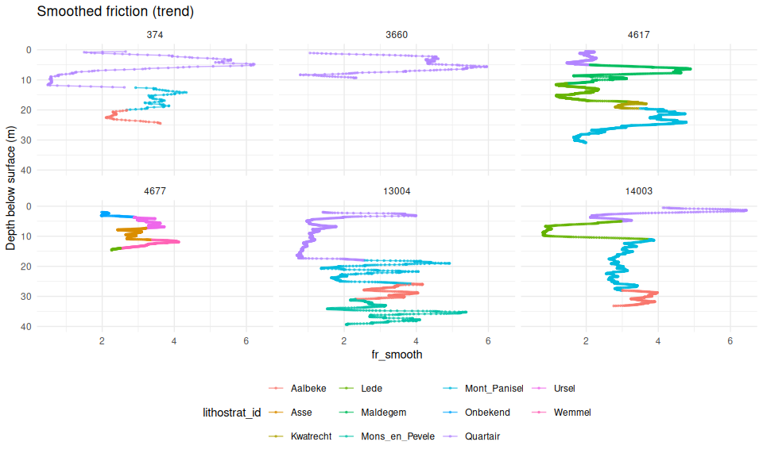


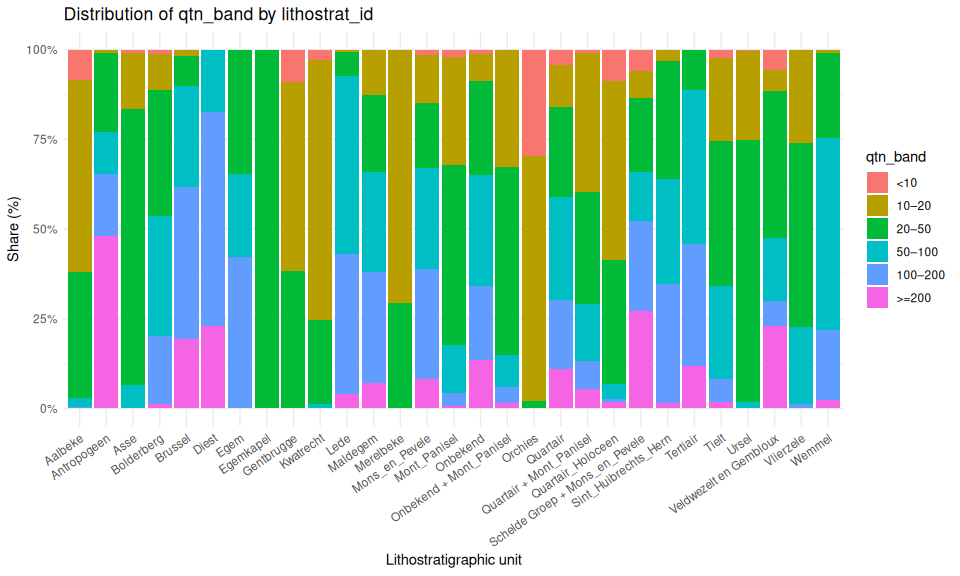

### What we learned from the literature (CPT soil subdivision)

- From the literature, we learned that **soil layers can be divided
  using CPT-based soil properties** such as cone resistance (**qc**),
  sleeve friction (**fs**), friction ratio (**Rf = fs/qc**), and
  normalized indices (**Qtn**, **Fr**).
- **Standard CPT charts** (e.g., Robertson) link these properties to
  **soil behavior types (SBT)** like clay, silt, sand, and dense
  sand/gravel.
- Several Belgian studies have shown how CPT data can be used to **map
  lithostratigraphic units more efficiently**:

### Figure: CPT Robertson plots

- The figure below is **derived from CPT measurements**, guided by
  **methods described in the literature**.

- It shows how **different soil types can be distinguished** using
  measured and normalized CPT properties:

  - Left: **qc–Rf space** shows the relation between cone resistance and
    friction ratio.
  - Right: **Qtn–Fr space** shows normalized values useful for comparing
    different sites.

- Colors represent **soil behavior groups** such as *silt/sandy silt*,
  *sand*, *mixed/transitional*, and *dense sand/gravel*.

``` r
library(scales)
library(patchwork)
library(hexbin)


cpt_df[, rf_ratio := fs / qc]
cpt_df[, rf_pct   := 100 * rf_ratio]

# 'fr' appears to be percent already but can have big outliers.
# Make an explicit 'fr_pct' and lightly winsorize for visuals/features.
cpt_df[, fr_pct := as.numeric(fr)]
cpt_df[is.finite(fr_pct), fr_pct := pmin(fr_pct, 20)]   


# summary(cpt_df[, .(qc, fs, rf_ratio, rf_pct, qtn, fr_pct)])


# Prefer normalized Qtn–Fr space if both present; otherwise fall back to qc–Rf.
has_norm <- all(c("qtn", "fr_pct") %in% names(cpt_df))

if (has_norm) {
  # thresholds are sensible starters; tune per basin if desired
  cpt_df[, behavior := fcase(
    fr_pct >= 2   & qtn < 10,                     "Clay / organic",
    fr_pct >= 1   & qtn >= 10 & qtn < 50,         "Silt / sandy silt",
    fr_pct <  1.5 & qtn >= 50 & qtn < 200,        "Sand",
    fr_pct <  0.5 & qtn >= 200,                   "Dense sand / gravel",
    default = "Mixed / transitional"
  )]
} else {
  cpt_df[, behavior := fcase(
    qc < 0.5  & rf_pct > 5,                       "Organic / peat",
    qc < 1.5  & rf_pct >= 2,                       "Clay (soft)",
    qc < 4.0  & rf_pct >= 1.5,                     "Clay / silty clay",
    qc >= 4.0  & qc < 10  & rf_pct <= 1.5,         "Sand (loose)",
    qc >= 10.0 & qc < 20  & rf_pct <= 1.2,         "Sand (medium)",
    qc >= 20.0 & qc < 40  & rf_pct <= 1.0,         "Sand (dense)",
    qc >= 40.0 & rf_pct <  0.5,                    "Dense sand / gravel",
    default = "Mixed / transitional"
  )]
}

cpt_df[, behavior := factor(behavior)]
```

``` r
plot_robertson_pair <- function(dt,
                                sonder_id,
                                color_var = "behavior",
                                palette = "Set2",
                                point_alpha = 0.55,
                                point_size = 1,
                                title_prefix = "CPT Robertson plots") {
  stopifnot(data.table::is.data.table(dt))
  stopifnot(color_var %in% names(dt))

  sub_dt <- dt[sondering_id == sonder_id]
  if (nrow(sub_dt) == 0L) stop("No rows for sondering_id = ", sonder_id)

  col_sym <- rlang::ensym(color_var)

  pA <- ggplot(sub_dt, aes(x = rf_pct, y = qc, color = !!col_sym)) +
    geom_point(alpha = point_alpha, size = point_size) +
    scale_y_log10(name = expression(paste("Cone resistance  ", q[c], " (MPa)")),
                  breaks = c(0.1, 0.5, 1, 5, 10, 50),
                  limits = c(0.1, 60)) +
    scale_x_continuous(name = expression(paste("Friction ratio  ", R[f], " (%)")),
                       limits = c(0, 8),
                       expand = expansion(mult = c(0.01, 0.05))) +
    labs(title = "qc–Rf space", color = color_var) +
    theme_minimal(base_size = 11)

  pB <- ggplot(sub_dt, aes(x = fr_pct, y = qtn, color = !!col_sym)) +
    geom_point(alpha = point_alpha, size = point_size) +
    scale_x_log10(name = expression(paste("Normalized friction ratio  ", F[r], " (%)")),
                  breaks = c(0.1, 0.2, 0.5, 1, 2, 5, 10),
                  limits = c(0.1, 10)) +
    scale_y_log10(name = expression(paste("Normalized cone resistance  ", Q[t][n])),
                  breaks = c(1, 5, 10, 50, 100, 500),
                  limits = c(1, 600)) +
    labs(title = "Qtn–Fr space", color = color_var) +
    theme_minimal(base_size = 11)

  if (!is.null(palette)) {
    pA <- pA + scale_color_brewer(palette = palette)
    pB <- pB + scale_color_brewer(palette = palette)
  }

  (pA | pB) +
    patchwork::plot_annotation(
      title = sprintf("%s — sondering %s", title_prefix, sonder_id)
    )
}

set.seed(300)
ids <- sample(cpt_df[!is.na(lithostrat_id), unique(sondering_id)], 10)
for (sid in ids) print(plot_robertson_pair(cpt_df, sid, color_var = "behavior"))
```


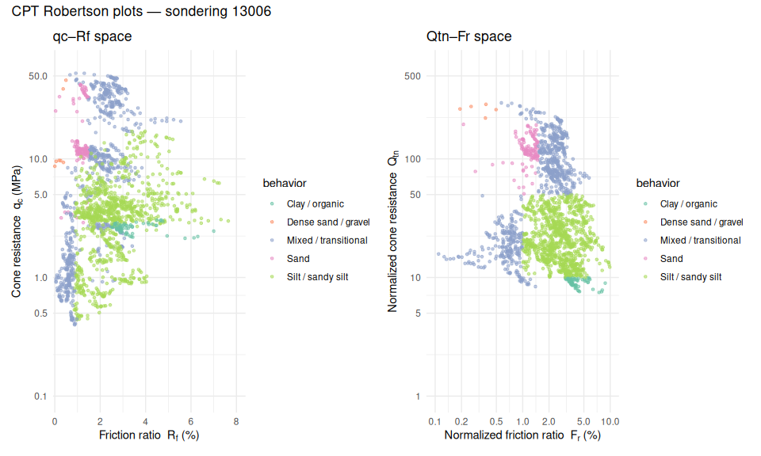

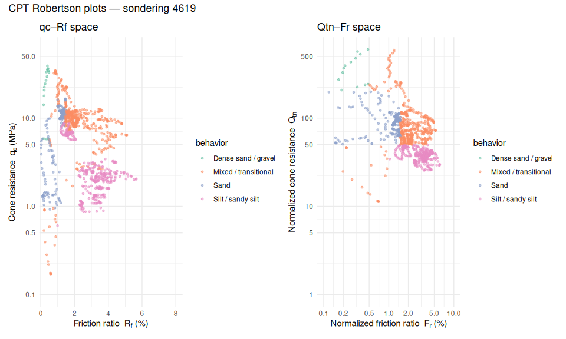


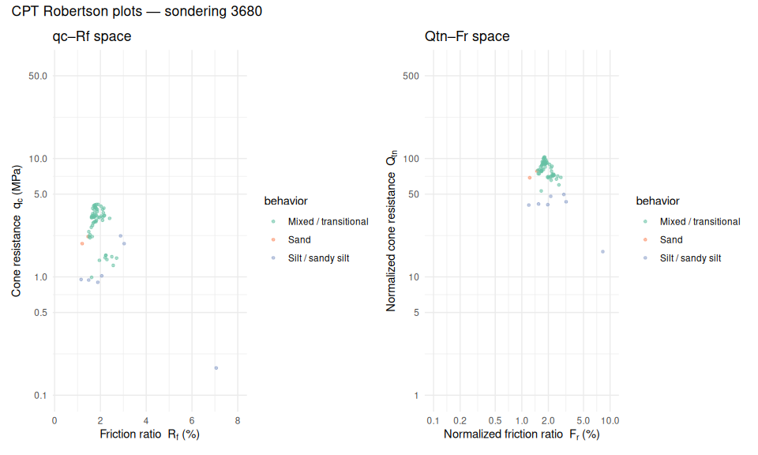


- Color the same abobe with lithorstat ID

``` r
for (sid in ids) print(plot_robertson_pair(cpt_df[!is.na(lithostrat_id)], 
                                           sid, color_var = "lithostrat_id"))
```


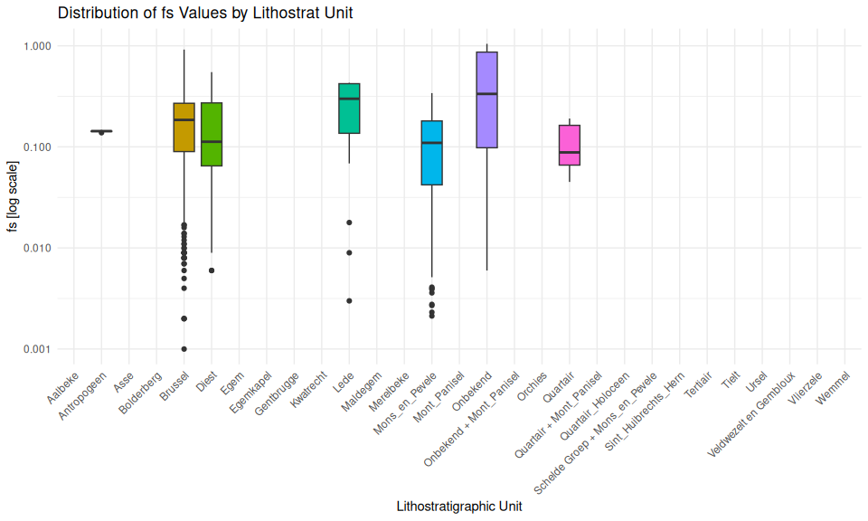

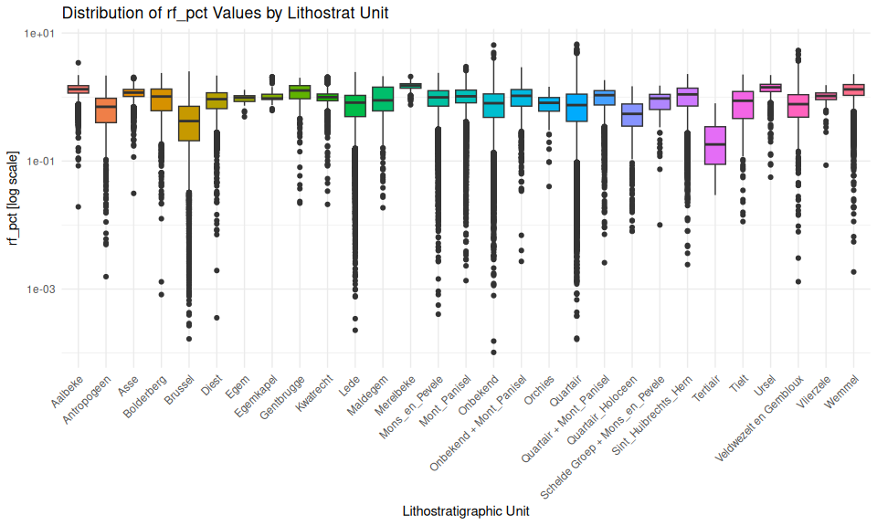


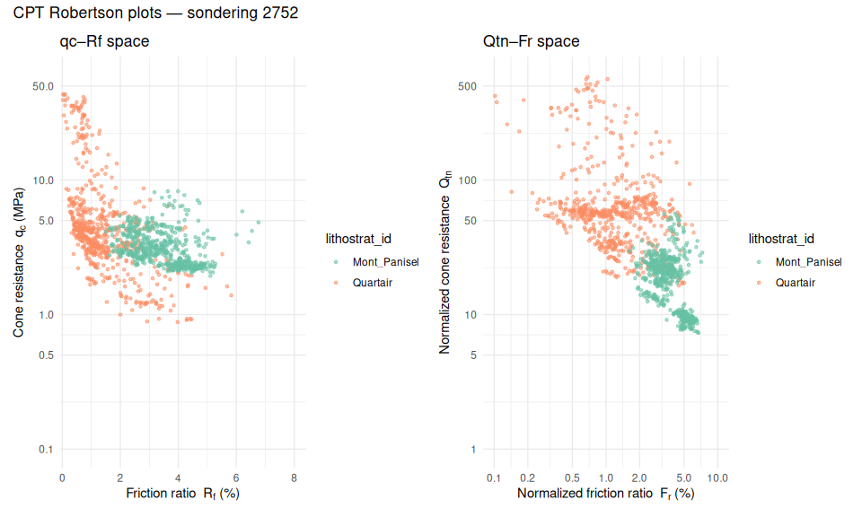

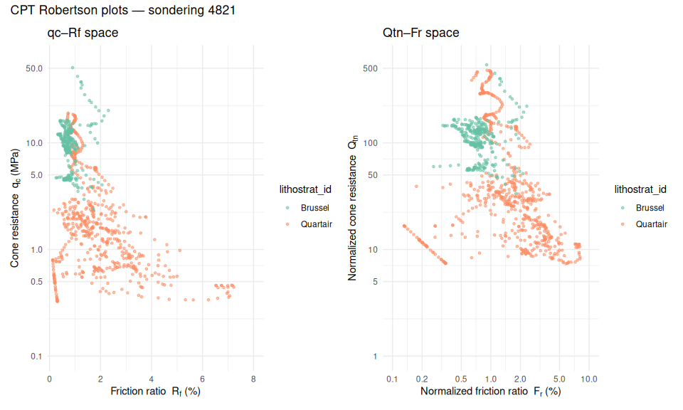


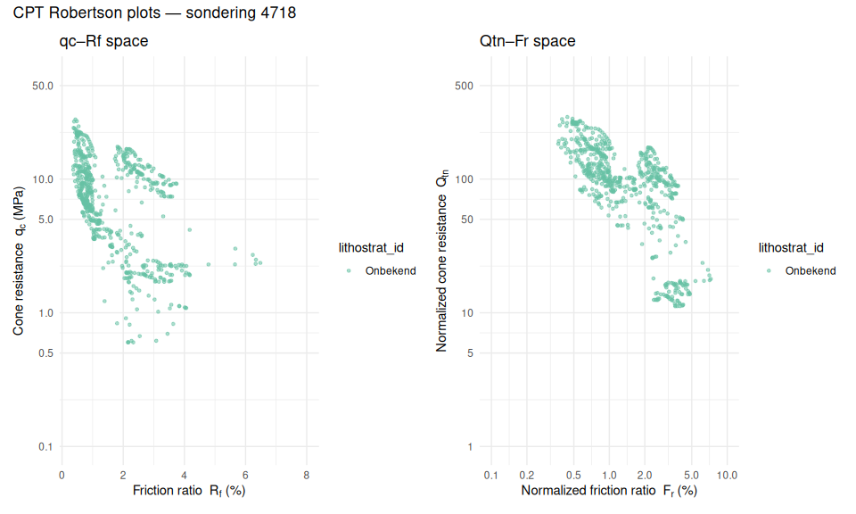

- Randomly select 10 drillings and plot cpt data

``` r
set.seed(124)
unique_sonde_lithor <- cpt_df |>
  unique(by = c("sondering_id", "lithostrat_id"))

unique_sonde_n <- unique_sonde_lithor[, .(freq = .N), by = sondering_id][freq>=2]
sampled_drillings <-  unique_sonde_n[, sample(unique(sondering_id), 10)]
sampled_data <- cpt_df[sondering_id %in% sampled_drillings]
data.table::setorder(sampled_data, index)


plot_cpt_series <- function(data,
                            depth_col = "diepte",
                            value_col = "qc",
                            color_var = "lithostrat_id",
                            group_var = NULL,
                            facet_var = "sondering_id",
                            title = NULL,
                            depth_label = "Depth below surface (m)",
                            value_label = NULL,
                            ncol_facet = 3,
                            log_value = FALSE,
                            reverse_depth = TRUE,
                            flip_coords = TRUE,
                            alpha_line = 0.7,
                            alpha_point = 0.6,
                            point_size = 0.6,
                            legend_position = "bottom") {
  depth_sym <- rlang::ensym(depth_col)
  value_sym <- rlang::ensym(value_col)
  color_sym <- if (is.null(color_var)) {
    NULL
  } else {
    rlang::ensym(color_var)
  }
  group_sym <- if (is.null(group_var) && !is.null(color_var)) {
    rlang::ensym(color_var)
  } else if (is.null(group_var)) {
    rlang::ensym(facet_var)
  } else {
    rlang::ensym(group_var)
  }
  value_label <- value_label %||% value_col

  p <- ggplot(data, aes(x = !!depth_sym, y = !!value_sym)) +
    geom_line(aes(group = interaction(!!rlang::enquo(group_sym))), alpha = alpha_line) +
    geom_point(aes(group = interaction(!!rlang::enquo(group_sym))), size = point_size, alpha = alpha_point)

  if (!is.null(color_sym)) {
    p <- p + aes(color = factor(!!color_sym))
  }

  if (log_value) {
    p <- p + scale_y_log10()
  }
  if (reverse_depth) {
    p <- p + scale_x_reverse()
  }
  if (flip_coords) {
    p <- p + coord_flip()
  }

  p +
    facet_wrap(stats::as.formula(paste("~", facet_var)), ncol = ncol_facet) +
    labs(
      title = title %||% sprintf("CPT Profiles (%s vs depth)", value_col),
      x = depth_label,
      y = value_label,
      color = color_var %||% NULL
    ) +
    theme_minimal() +
    theme(legend.position = legend_position)
}


plot_cpt_series(sampled_data,
  value_col = "qc",
  title = "Cone resistance"
)
```


``` r
plot_cpt_series(sampled_data,
  value_col = "fr",
  title = "friction"
)
```

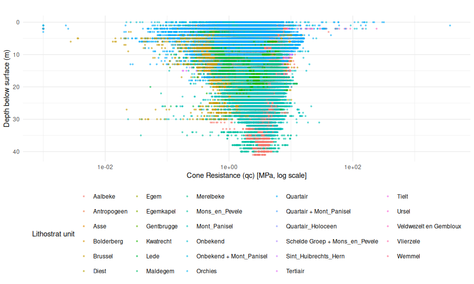

- lets smooth the qc and fs with rolling mean of window 3
- is the frequency obeying some symmetry

``` r
# use decompose function to
extract_trend <- function(x, freq = 5L) {
  x <- as.numeric(x)
  # If frequency invalid or not enough data for 2 periods, return original series
  if (!is.finite(freq) || freq < 2L) return(x)
  if (length(na.omit(x)) < 2L) return(x)
  if (length(x) < 2L * freq) return(x)

  out <- tryCatch({
    dc <- decompose(ts(x, frequency = freq))
    tr <- dc$trend
    # If decompose produced all-NA trend, fall back to original; otherwise fill edge NAs with original values
    if (all(is.na(tr))) x else ifelse(is.na(tr), x, tr)
  }, error = function(e) x, warning = function(w) x)

  out
}

freq_from_depth <- function(z, default = 25L) {
  if (length(z) < 2L) {
    return(default)
  }
  dz <- stats::median(diff(sort(z)), na.rm = TRUE)
  if (!is.finite(dz) || dz <= 0) {
    return(default)
  }
  as.integer(max(1, round(1 / dz)))
}


sampled_data[, fr_smooth := extract_trend(fr, freq = freq_from_depth(diepte)),
  by = sondering_id
]
sampled_data[, qc_smooth := extract_trend(qc, freq = freq_from_depth(diepte)),
  by = sondering_id
]
```

- plot qc_smooth

``` r
plot_cpt_series(sampled_data[!is.na(lithostrat_id)],
  value_col = "qc_smooth",
  title = "Smoothed Cone resistance (trend)"
)
```


- plot fr_smooth

``` r
plot_cpt_series(sampled_data,
  value_col = "fr_smooth",
  title = "Smoothed friction (trend)"
)
```

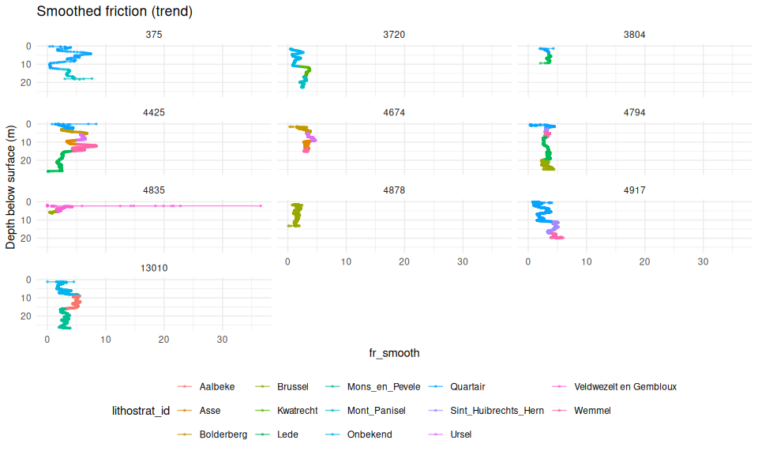

``` r
cpt_df_all <- copy(cpt_df)
cpt_df <- cpt_df[!is.na(lithostrat_id)]
```

``` r
library(signal)
library(pracma)
# Zero-phase Butterworth low-pass
butter_zero_phase <- function(x, dz, fc = 1.0, order = 4L) {
  # fc in cycles/m; dz in meters/sample
  if (!is.finite(dz) || dz <= 0 || all(!is.finite(x))) return(x)
  nyq <- 1/(2*dz)                    # Nyquist (cycles/m)
  Wc  <- min(0.99, max(1e-6, fc/nyq))# normalized cutoff 0..1
  bf  <- signal::butter(order, Wc, type = "low")
  # detrend first to keep DC drift from dominating:
  xd  <- pracma::detrend(x, tt = "linear")
  as.numeric(signal::filtfilt(bf, xd))
}

vars_to_plot <- c("qc", "fs", "rf", "qtn", "fr")

filterd_vars <- paste0(vars_to_plot, "butter_zero")
cpt_df[, dz := median(diff(diepte), na.rm = TRUE), by = sondering_id]
cpt_df[, (filterd_vars) := lapply(.SD, butter_zero_phase, dz =dz[1]),
       .SDcols = vars_to_plot,
       by = sondering_id
]
```

``` r
# boxplotqc, rf_pct, qtn, fr by lithostrat_id

vars_to_plot <- c("qc", "fs", "rf", "qtn",  "fr")

lapply(X = vars_to_plot, FUN = function(var) {
    p <- ggplot(cpt_df, aes(x = lithostrat_id, y = log(.data[[var]]), fill = lithostrat_id)) +
        geom_boxplot() +
        scale_y_log10() +
        labs(
        title = paste("Distribution of", var, "Values by Lithostrat Unit"),
        x = "Lithostratigraphic Unit",
        y = paste(var, "[log scale]"),
        fill = "Lithostrat unit"
        ) +
        theme_minimal() +
        theme(
        axis.text.x = element_text(angle = 45, hjust = 1),
        legend.position = "none"
        )
    p
    
    })
```

    [[1]]


    [[2]]


    [[3]]


    [[4]]


    [[5]]

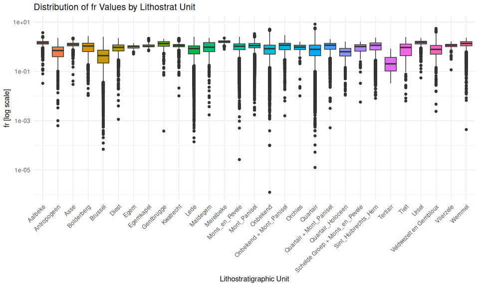

- plot series of filtered vars

``` r
for(var in filterd_vars) {
  p <- plot_cpt_series(cpt_df[sondering_id %in% ids],
    value_col = var,
    title = paste("Filtered", var, "vs Depth")
  )
  print(p)
}
```

``` r
cpt_model_df <- cpt_df[!is.na(rf)]

# 1) Five-number summary of qc PER DRILLING (sondering_id)

# cut depth into bins of 1m
cpt_model_df[, diepte := round(diepte)]
cpt_model_df[, diepte_bin := cut(diepte, breaks = seq(
  from = 0, to = max(diepte, na.rm = TRUE), by = 5
))]

# remove N
```

- bar plot of lithostrat_id vs depth bins

``` r
# bar plot of lithostrat_id  vs depth bins
ggplot(cpt_model_df, aes(x = diepte_bin, fill = as.factor(lithostrat_id))) +
  geom_bar(position = "fill") +
  labs(
    title = "Proportion of Lithostrat Units by Depth Bins",
    x = "Depth Bins (m)",
    y = "Proportion",
    fill = "Lithostrat unit"
  ) +
  theme_minimal() +
  theme(
    axis.text.x = element_text(angle = 45, hjust = 1),
    legend.position = "bottom"
  )
```


``` r
value_vars <-c("qc", "fs", "rf", "qtn", "fr")
diff_vars <- paste0(value_vars, "_diff") 
# calculate diff by soldering id 
cpt_model_df[, (diff_vars) := lapply(.SD, function(x) c(NA, diff(x))),
              .SDcols = value_vars,
              by = sondering_id
              ]
```

``` r
trend_vars <- paste0(value_vars, "_trend")
# calculate trend by soldering id
cpt_model_df[, (trend_vars) := lapply(.SD, function(x) extract_trend(x, freq = freq_from_depth(diepte))),
              .SDcols = value_vars,
              by = sondering_id
              ]
```

``` r
dcast_cpt_wide <- function(dt,
                           value_cols,
                           depth_bin = "diepte_bin",
                           id_cols = c("sondering_id", "lithostrat_id"),
                           agg_funs = list(
                                           median =  function(x) median(x, na.rm = TRUE),
                                           mean = function(x) mean(x, na.rm = TRUE),
                                           q25 = function(x) quantile(x, 0.25, na.rm = TRUE),
                                           q75 = function(x) quantile(x, 0.75, na.rm = TRUE),
                                           min = function(x)  min(x, na.rm = TRUE),
                                           max = function(x)  max(x, na.rm = TRUE)),
                           fill_value = 0,
                           na_rm_cols = TRUE) {
  stopifnot(all(value_cols %in% names(dt)))
  
  if (is.function(agg_funs)) {
    agg_funs <- list(custom = agg_funs)
  }
  if (is.null(names(agg_funs))) {
    names(agg_funs) <- paste0("fn", seq_along(agg_funs))
  }
  
  wide_list <- lapply(value_cols, function(vcol) {
    lapply(seq_along(agg_funs), function(i) {
      fun <- agg_funs[[i]]
      fun_nm <- names(agg_funs)[i]
      cat(fun_nm)
      out <- data.table::dcast(
        formula = as.formula(paste(
          paste(id_cols, collapse = "+"), "~", depth_bin
        )),
        value.var = vcol,
        fun.aggregate = fun,
        data = dt,
        fill = fill_value
      )
      
      data_cols <- setdiff(names(out), id_cols)
      setnames(out, data_cols, paste0(data_cols, "_", vcol, "_", fun_nm))
      out
    })
  }) |>
    unlist(recursive = FALSE)
  
  wide_dt <- Reduce(function(a, b)
    merge(a, b, by = id_cols, all = TRUE), wide_list)
  
  if (na_rm_cols) {
    keep <- colSums(is.na(wide_dt)) < nrow(wide_dt)
    wide_dt <- wide_dt[, ..keep]
  }
  
  wide_dt[]
}


# bins of one meter
cpt_model_df <- cpt_model_df[!is.na(diepte)]
cpt_model_df[, diepte_bin := cut(diepte,
  breaks = seq(
    from = 0, to = max(diepte, na.rm = TRUE) + 5, by = .6
  ),
  include.lowest = TRUE
)]


# cpt_model_df[!is.na(fs), fs_smooth := extract_trend(fs, freq = freq_from_depth(diepte)),
#              by = sondering_id]
# cpt_model_df[!is.na(qc), qc_smooth := extract_trend(qc, freq = freq_from_depth(diepte)),
#              by = sondering_id]


value_vars <-c("qc", "fs", "rf", "qtn", "fr")


cpt_wide <- dcast_cpt_wide(cpt_model_df,
  value_cols = c(trend_vars),
  depth_bin = "diepte_bin",
  id_cols = c("sondering_id", "lithostrat_id"),
  agg_funs = list(
    median = function(x) median(x, na.rm = TRUE),
    mean = function(x) mean(x, na.rm = TRUE),
    q25 = function(x) quantile(x, 0.25, na.rm = TRUE),
    q75 = function(x) quantile(x, 0.75, na.rm = TRUE),
    min = function(x) min(x, na.rm = TRUE),
    max = function(x) max(x, na.rm = TRUE)
  ),
  fill_value = 0,
  na_rm_cols = TRUE
)
```

    medianmeanq25q75minmaxmedianmeanq25q75minmaxmedianmeanq25q75minmaxmedianmeanq25q75minmaxmedianmeanq25q75minmax

``` r
#cpt_wide <- cpt_wide[sondering_id %in% pair_dt$sondering_id]
```

``` r
widen_factor_indicators <- function(dt,
                                    factor_cols,
                                    id_cols = c("sondering_id", "lithostrat_id"),
                                    na_label = NULL) {
  stopifnot(data.table::is.data.table(dt))
  stopifnot(all(c(factor_cols, id_cols) %in% names(dt)))

  widen_one <- function(col) {
    tmp <- dt[, c(id_cols, col), with = FALSE]
    setnames(tmp, col, "factor_value")
    if (!is.null(na_label)) tmp[is.na(factor_value), factor_value := na_label]

    wide <- dcast(
      tmp,
      as.formula(paste(paste(id_cols, collapse = " + "), "~ factor_value")),
      value.var = "factor_value",
      fun.aggregate = function(x) as.integer(any(!is.na(x))),
      fill = 0
    )

    value_cols <- setdiff(names(wide), id_cols)
    setnames(wide, value_cols, paste0(col, "_", value_cols))
    wide
  }

  merged <- Reduce(function(a, b) merge(a, b, by = id_cols, all = TRUE),
                   lapply(factor_cols, widen_one))
  num_cols <- setdiff(names(merged), id_cols)
  merged[, (num_cols) := lapply(.SD, function(v) fifelse(is.na(v), 0L, v)), .SDcols = num_cols]
  merged[]
}


factor_vars <- c("behavior", "rf_band", 
                 "qc_band", "fr_band", 
                 "qtn_band")

cpt_wide_factors <- widen_factor_indicators(cpt_model_df, factor_vars)

cpt_wide <- merge(cpt_wide, cpt_wide_factors,
  by = c("sondering_id", "lithostrat_id"),
  all.x = TRUE
)
```

``` r
ggplot(cpt_wide, aes(x = lithostrat_id,
                     fill = as.factor(lithostrat_id))) +
  geom_bar() +
  labs(
    title = "Bar Plot of Lithostratigraphic Units",
    x = "Lithostratigraphic Unit",
    y = "Count",
    fill = "Lithostratigraphic Unit"
  ) +
  theme_minimal() +
  theme(
    legend.position = "none",
    axis.text.x = element_text(angle = 45, hjust = 1)
  )
```


``` r
# get freq by lithostrat_id
litho_counts <- cpt_wide[, .N, by = lithostrat_id]
# get lithostrat_id with more than 10 counts
rare_litho <- litho_counts[N < 5, lithostrat_id]
cpt_wide <- cpt_wide[!lithostrat_id %in% rare_litho,]
```

``` r
library(xgboost)
library(rsample) 
library(yardstick)

cpt_wide[, lithostrat_id_group := lithostrat_id ]

# 0) Keep only rows with a target
cpt_wide <- cpt_wide[!is.na(lithostrat_id_group)]
#save(cpt_wide, file = here(data_folder, "cpt_wide.rda"))
# 1) Define features (drop ids/target)
feat_cols <- setdiff(names(cpt_wide),
                     c("sondering_id", "lithostrat_id", 
                       "lithostrat_id_group", "two_layers"))


# feat_cols_quoted <- paste0("`", feat_cols, "`")
# options(expressions = 50000)
# model_formula <- as.formula(
#   paste("lithostrat_id ~", paste(feat_cols, collapse = " + "))
# )
```

``` r
ycol_xcols <- c("lithostrat_id", feat_cols, "sondering_id")
cpt_model_df2 <- cpt_wide[, ..ycol_xcols]
```

``` r
library(tidymodels)


# build weights
w_lookup <- cpt_model_df2 %>%
  count(lithostrat_id, name = "n") %>%
  mutate(w = max(n) / n)

cpt_w <- cpt_model_df2 %>%
  left_join(w_lookup, by = "lithostrat_id") %>%
  mutate(wts = hardhat::importance_weights(w)) %>%
  select(-w)
```

``` r
group_strat_split <- function(dt,
                              id_col = "sondering_id",
                              y_col = "lithostrat_id",
                              prop = 0.7,
                              tol = 0.05,
                              max_tries = 200,
                              seed = 42) {
  setDT(dt)
  ids_lab <- dt[, .(mode_class = names(which.max(table(get(
    y_col
  ))))), by = id_col]
  full_counts <- dt[, .N, by = y_col]
  
  for (s in seq_len(max_tries)) {
    set.seed(seed + s - 1)
    spl <- initial_split(as.data.frame(ids_lab),
                         prop = prop,
                         strata = mode_class)
    tr_ids <- training(spl)[[id_col]]
    tr_dt  <- dt[get(id_col) %in% tr_ids]
    tr_counts <- tr_dt[, .N, by = y_col]
    chk <- tr_counts[full_counts, on = y_col][, pct := i.N / N][, all(abs(pct - prop) <= tol)]
    
    if (isTRUE(chk)) {
      te_ids <- testing(spl)[[id_col]]
      return(list(
        train_ids = tr_ids,
        test_ids = te_ids,
        seed = seed + s - 1
      ))
    }
  }
  # fallback (last attempt)
  list(
    train_ids = tr_ids,
    test_ids = testing(spl)[[id_col]],
    seed = seed + max_tries - 1
  )
}

res <- group_strat_split(cpt_w, prop = 0.7, tol = 0.05)
train_dt <- cpt_w[sondering_id %in% res$train_ids]
test_dt  <- cpt_w[sondering_id %in% res$test_ids]
```

``` r
# recipe: exclude wts from predictors in the formula (do not set case_weights role here)
library(RBF)
library(embed) 
xgb_rec <- recipe(lithostrat_id ~ . , data = train_dt |> select(-n)) |>
  update_role(sondering_id, new_role = "group_id") |>
  step_rm(sondering_id) |>
  step_zv(all_predictors()) |>
  step_nzv(all_predictors()) |>
  step_center(all_numeric_predictors()) |>
  step_impute_median(all_numeric_predictors()) |>
  step_normalize(all_numeric_predictors(), na_rm = TRUE) |>
  step_scale(all_numeric_predictors()) |>
  #step_corr(all_numeric_predictors(), threshold = 0.95) |>
  step_pca(all_numeric_predictors(), num_comp = 200) 
  #step_kpca(all_numeric_predictors(), num_comp = 50, kernel = "rbfdot", sigma = tune())

xgb_spec <- boost_tree(
  trees          = 500,
  tree_depth     = tune(),
  learn_rate     = tune(),
  loss_reduction = tune(),
  min_n          = tune(),
  mtry           = tune(),
  sample_size    = tune()
) |>
  set_mode("classification") |>
  set_engine("xgboost")

# Ranger Random Forest spec (supports case weights via workflow)
rf_spec <- rand_forest(
  trees = 500,
  mtry  = tune(),
  min_n = tune()
) |>
  set_mode("classification") |>
  set_engine("ranger", importance = "permutation")

xgb_wf <- workflow() |>
  add_recipe(xgb_rec) |>
  add_model(xgb_spec)

# Attach case weights to the workflow
xgb_wf_w <- xgb_wf |> add_case_weights(wts)

# RF workflow (reuse same recipe)
rf_wf <- workflow() |>
  add_recipe(xgb_rec) |>
  add_model(rf_spec)

# Attach case weights for RF
rf_wf_w <- rf_wf |> add_case_weights(wts)
```

``` r
library(future)
library(furrr)

# grouped CV
set.seed(42)
folds <- group_vfold_cv(cpt_w, group = sondering_id, v = 10)

# params/grid
xgb_params <- extract_parameter_set_dials(xgb_wf) |>
  finalize(cpt_w |> dplyr::select(-lithostrat_id, -sondering_id, -wts, -n))

xgb_grid <- grid_latin_hypercube(xgb_params, size = 5)

# tune with weights (weights carried by the workflow)
set.seed(42)
plan(multisession, workers = parallel::detectCores() - 4)
xgb_res <- tune_grid(
  xgb_wf_w,
  resamples = folds,
  grid = xgb_grid,
  metrics =yardstick::metric_set(accuracy, mn_log_loss),
  control = control_grid(save_pred = TRUE)
)

rf_params <- extract_parameter_set_dials(rf_wf) |>
  finalize(cpt_w |> dplyr::select(-lithostrat_id, -sondering_id, -wts, -n))

rf_grid <- grid_latin_hypercube(rf_params, size = 5)

rf_res <- tune_grid(
  rf_wf_w,
  resamples = folds,
  grid = rf_grid,
  metrics = yardstick::metric_set(accuracy, mn_log_loss),
  control = control_grid(save_pred = TRUE)
)

plan(sequential) # back to sequential
# final fit (weights carried by the workflow)
```

#### xgb metrics

``` r
xgb_metrics <- collect_metrics(xgb_res)
kable(xgb_metrics)
```

| mtry | min_n | tree_depth | learn_rate | loss_reduction | sample_size | .metric | .estimator | mean | n | std_err | .config |
|---:|---:|---:|---:|---:|---:|:---|:---|---:|---:|---:|:---|
| 249 | 23 | 1 | 0.0034829 | 1.5096469 | 0.4885059 | accuracy | multiclass | 0.3816525 | 10 | 0.0105761 | pre0_mod1_post0 |
| 249 | 23 | 1 | 0.0034829 | 1.5096469 | 0.4885059 | mn_log_loss | multiclass | 2.3693611 | 10 | 0.0127002 | pre0_mod1_post0 |
| 404 | 30 | 15 | 0.0286017 | 0.0000000 | 0.2719552 | accuracy | multiclass | 0.4927415 | 10 | 0.0227924 | pre0_mod2_post0 |
| 404 | 30 | 15 | 0.0286017 | 0.0000000 | 0.2719552 | mn_log_loss | multiclass | 1.8403673 | 10 | 0.0338491 | pre0_mod2_post0 |
| 700 | 37 | 9 | 0.0016821 | 0.0000386 | 0.4228029 | accuracy | multiclass | 0.3710335 | 10 | 0.0203163 | pre0_mod3_post0 |
| 700 | 37 | 9 | 0.0016821 | 0.0000386 | 0.4228029 | mn_log_loss | multiclass | 2.5981125 | 10 | 0.0090685 | pre0_mod3_post0 |
| 813 | 15 | 7 | 0.2921063 | 0.0081378 | 0.9232397 | accuracy | multiclass | 0.5579953 | 10 | 0.0129670 | pre0_mod4_post0 |
| 813 | 15 | 7 | 0.2921063 | 0.0081378 | 0.9232397 | mn_log_loss | multiclass | 1.5022978 | 10 | 0.0471988 | pre0_mod4_post0 |
| 1202 | 5 | 11 | 0.0727259 | 0.0000000 | 0.6961426 | accuracy | multiclass | 0.5841693 | 10 | 0.0156547 | pre0_mod5_post0 |
| 1202 | 5 | 11 | 0.0727259 | 0.0000000 | 0.6961426 | mn_log_loss | multiclass | 1.4010584 | 10 | 0.0352874 | pre0_mod5_post0 |

#### rf metrics

``` r
rf_metrics <- collect_metrics(rf_res)
kable(rf_metrics)
```

| mtry | min_n | .metric     | .estimator |      mean |   n |   std_err | .config         |
|-----:|------:|:------------|:-----------|----------:|----:|----------:|:----------------|
|  214 |    23 | accuracy    | multiclass | 0.5151612 |  10 | 0.0182962 | pre0_mod1_post0 |
|  214 |    23 | mn_log_loss | multiclass | 1.6440094 |  10 | 0.0223611 | pre0_mod1_post0 |
|  372 |    27 | accuracy    | multiclass | 0.4961321 |  10 | 0.0172967 | pre0_mod2_post0 |
|  372 |    27 | mn_log_loss | multiclass | 1.7202036 |  10 | 0.0548237 | pre0_mod2_post0 |
|  695 |    39 | accuracy    | multiclass | 0.4561204 |  10 | 0.0219466 | pre0_mod3_post0 |
|  695 |    39 | mn_log_loss | multiclass | 1.7540621 |  10 | 0.0261012 | pre0_mod3_post0 |
|  821 |    16 | accuracy    | multiclass | 0.5301828 |  10 | 0.0156222 | pre0_mod4_post0 |
|  821 |    16 | mn_log_loss | multiclass | 1.6058575 |  10 | 0.0240000 | pre0_mod4_post0 |
| 1242 |     3 | accuracy    | multiclass | 0.5465225 |  10 | 0.0156265 | pre0_mod5_post0 |
| 1242 |     3 | mn_log_loss | multiclass | 1.6742226 |  10 | 0.0847137 | pre0_mod5_post0 |

``` r
cmp <- bind_rows(
  xgb_metrics |> dplyr::mutate(model = "xgb"),
  rf_metrics  |> dplyr::mutate(model = "ranger")
)

cmp_summary <- cmp |>
  dplyr::group_by(model, .metric) |>
  dplyr::summarize(mean = mean(mean), std_err = mean(std_err), .groups = "drop") |>
  dplyr::arrange(.metric, dplyr::desc(mean))

knitr::kable(cmp_summary)
```

| model  | .metric     |      mean |   std_err |
|:-------|:------------|----------:|----------:|
| ranger | accuracy    | 0.5088238 | 0.0177576 |
| xgb    | accuracy    | 0.4775184 | 0.0164613 |
| xgb    | mn_log_loss | 1.9422394 | 0.0276208 |
| ranger | mn_log_loss | 1.6796710 | 0.0423999 |

#### Final fit and predictions

``` r
xgb_fit <- finalize_workflow(xgb_wf_w, select_best(xgb_res, metric = "mn_log_loss")) |>
  fit(data = train_dt)
xgb_preds_prob <- predict(xgb_fit, new_data = test_dt, type = "prob")
xgb_preds_class <- predict(xgb_fit, new_data = test_dt)


cpt_model_pred_xgb <- bind_cols(
  test_dt[, .(sondering_id, lithostrat_id)],
  xgb_preds_class,
  xgb_preds_prob
)
```

#### Metrics with Yardstick

``` r
library(yardstick)

cpt_model_pred_xgb[, lithostrat_id := factor(lithostrat_id,
  levels = unique(cpt_wide$lithostrat_id)
)]
cpt_model_pred_xgb[, .pred_class := factor(.pred_class,
  levels = unique(cpt_wide$lithostrat_id)
)]
yardstick::conf_mat(
  data = cpt_model_pred_xgb,
  truth = lithostrat_id,
  estimate = .pred_class
)
```

                          Truth
    Prediction             Aalbeke Mont_Panisel Quartair Mons_en_Pevele Maldegem
      Aalbeke                   10            3        0              0        0
      Mont_Panisel               1           12        0              0        0
      Quartair                   0            0       45              0        0
      Mons_en_Pevele             0            2        0             10        1
      Maldegem                   0            0        0              0        0
      Brussel                    0            1        2              3        0
      Asse                       2            0        0              0        0
      Onbekend                   0            1        0              0        0
      Ursel                      0            1        0              0        0
      Wemmel                     0            0        0              2        0
      Lede                       0            0        0              0        0
      Bolderberg                 0            0        1              0        0
      Kwatrecht                  1            0        0              0        0
      Merelbeke                  0            0        0              0        0
      Antropogeen                0            0        0              0        0
      Diest                      0            0        0              0        0
      Sint_Huibrechts_Hern       0            0        0              0        0
                          Truth
    Prediction             Brussel Asse Onbekend Ursel Wemmel Lede Bolderberg
      Aalbeke                    0    0        0     0      0    0          0
      Mont_Panisel               0    0        0     0      0    0          0
      Quartair                   5    0       12     0      1    0          2
      Mons_en_Pevele             0    0        0     0      0    4          0
      Maldegem                   0    0        1     0      0    0          0
      Brussel                    8    0        0     0      0    4          1
      Asse                       0    9        0     1      1    0          0
      Onbekend                   0    0        3     0      0    0          0
      Ursel                      0    1        0     3      0    0          0
      Wemmel                     0    0        0     0     10    1          0
      Lede                       4    0        0     0      1    9          0
      Bolderberg                 0    0        0     0      0    0          0
      Kwatrecht                  0    0        0     1      0    0          0
      Merelbeke                  0    0        0     0      0    0          0
      Antropogeen                0    0        0     0      0    0          0
      Diest                      1    0        0     0      0    0          0
      Sint_Huibrechts_Hern       0    0        0     0      1    0          0
                          Truth
    Prediction             Kwatrecht Merelbeke Antropogeen Diest
      Aalbeke                      3         0           0     0
      Mont_Panisel                 2         0           0     0
      Quartair                     0         0           0     0
      Mons_en_Pevele               1         0           0     0
      Maldegem                     0         0           0     0
      Brussel                      0         0           0     0
      Asse                         1         0           0     0
      Onbekend                     0         0           0     0
      Ursel                        1         1           0     0
      Wemmel                       0         0           0     0
      Lede                         0         0           0     0
      Bolderberg                   0         0           1     0
      Kwatrecht                    0         0           0     0
      Merelbeke                    0         1           0     0
      Antropogeen                  0         0           0     0
      Diest                        0         0           0     2
      Sint_Huibrechts_Hern         0         0           0     0
                          Truth
    Prediction             Sint_Huibrechts_Hern
      Aalbeke                                 0
      Mont_Panisel                            0
      Quartair                                0
      Mons_en_Pevele                          0
      Maldegem                                0
      Brussel                                 0
      Asse                                    0
      Onbekend                                0
      Ursel                                   0
      Wemmel                                  0
      Lede                                    0
      Bolderberg                              0
      Kwatrecht                               0
      Merelbeke                               0
      Antropogeen                             0
      Diest                                   2
      Sint_Huibrechts_Hern                    0

``` r
# xgb accuracy, auc, roc, balanced accuracy
metrics_set <- yardstick::metric_set(accuracy, bal_accuracy)

xgb_eval <- metrics_set(
  data = cpt_model_pred_xgb,
  truth = lithostrat_id,
  estimate = .pred_class
)
knitr::kable(xgb_eval)
```

| .metric      | .estimator | .estimate |
|:-------------|:-----------|----------:|
| accuracy     | multiclass | 0.6192893 |
| bal_accuracy | macro      | 0.7156289 |

``` r
rf_fit <- finalize_workflow(rf_wf_w, select_best(rf_res, metric = "mn_log_loss")) |>
    fit(data = train_dt)
rf_preds_prob <- predict(rf_fit, new_data = test_dt, type = "prob")
rf_preds_class <- predict(rf_fit, new_data = test_dt)
cpt_model_pred_rf <- bind_cols(
    test_dt[, .(sondering_id, lithostrat_id)],
    rf_preds_class,
    rf_preds_prob
)
```

``` r
cpt_model_pred_rf[, lithostrat_id := factor(lithostrat_id,
    levels = unique(cpt_wide$lithostrat_id)
)]
cpt_model_pred_rf[, .pred_class := factor(.pred_class,
    levels = unique(cpt_wide$lithostrat_id)
)]
conf_mat_xgb <- yardstick::conf_mat(
    data = cpt_model_pred_rf,
    truth = lithostrat_id,
    estimate = .pred_class
)
```

``` r
# Long-format confusion with per-truth rates and per-class accuracy (diagonal) — data.table
cm_dt <- as.data.table(as.data.frame(conf_mat_xgb$table))
setnames(cm_dt, c("Prediction", "Truth", "Freq"),
               c("predicted_class", "lithostrat_id", "n"))

# Rate of each predicted class within each true lithostrat_id
cm_dt[, total := sum(n), by = .(lithostrat_id)]
cm_dt[, rate  := fifelse(total > 0, n/total, NA_real_)]

# Per-soil-type prediction accuracy (diagonal proportion)
per_class_accuracy_rf <- cm_dt[predicted_class == lithostrat_id,
  .(lithostrat_id, predicted_class, accuracy = rate, sample_size = total)
]

knitr::kable(per_class_accuracy_rf, caption = "Per-class prediction accuracy (RF)")
```

| lithostrat_id        | predicted_class      |  accuracy | sample_size |
|:---------------------|:---------------------|----------:|------------:|
| Aalbeke              | Aalbeke              | 0.4285714 |          14 |
| Mont_Panisel         | Mont_Panisel         | 0.5000000 |          20 |
| Quartair             | Quartair             | 0.5208333 |          48 |
| Mons_en_Pevele       | Mons_en_Pevele       | 0.6000000 |          15 |
| Maldegem             | Maldegem             | 0.0000000 |           1 |
| Brussel              | Brussel              | 0.3333333 |          18 |
| Asse                 | Asse                 | 0.8000000 |          10 |
| Onbekend             | Onbekend             | 0.3125000 |          16 |
| Ursel                | Ursel                | 0.6000000 |           5 |
| Wemmel               | Wemmel               | 0.5000000 |          14 |
| Lede                 | Lede                 | 0.2222222 |          18 |
| Bolderberg           | Bolderberg           | 0.0000000 |           3 |
| Kwatrecht            | Kwatrecht            | 0.2500000 |           8 |
| Merelbeke            | Merelbeke            | 0.5000000 |           2 |
| Antropogeen          | Antropogeen          | 0.0000000 |           1 |
| Diest                | Diest                | 1.0000000 |           2 |
| Sint_Huibrechts_Hern | Sint_Huibrechts_Hern | 0.0000000 |           2 |

Per-class prediction accuracy (RF)


    ::: {.cell}

    ```{.r .cell-code}
    # rf accuracy, auc, roc, balanced accuracy
    metrics_set <- yardstick::metric_set(accuracy, bal_accuracy)

    rf_eval <- metrics_set(
      data = cpt_model_pred_rf,
      truth = lithostrat_id,
      estimate = .pred_class
    )
    knitr::kable(rf_eval)

<div class="cell-output-display">

| .metric      | .estimator | .estimate |
|:-------------|:-----------|----------:|
| accuracy     | multiclass | 0.4467005 |
| bal_accuracy | macro      | 0.6753083 |

</div>

:::

### Error Analaysis

#### Get misclassified drillings in XGB

``` r
xgb_misclass <- cpt_model_pred_xgb[lithostrat_id != .pred_class]
fwrite(xgb_misclass, file = here(
    results_folder,
    "missclasified_cpt_model_predictions_xgb.csv"
))
knitr::kable(xgb_misclass)
```

| sondering_id | lithostrat_id | .pred_class | .pred_Aalbeke | .pred_Antropogeen | .pred_Asse | .pred_Bolderberg | .pred_Brussel | .pred_Diest | .pred_Kwatrecht | .pred_Lede | .pred_Maldegem | .pred_Merelbeke | .pred_Mons_en_Pevele | .pred_Mont_Panisel | .pred_Onbekend | .pred_Quartair | .pred_Sint_Huibrechts_Hern | .pred_Ursel | .pred_Wemmel |
|---:|:---|:---|---:|---:|---:|---:|---:|---:|---:|---:|---:|---:|---:|---:|---:|---:|---:|---:|---:|
| 316 | Quartair | Brussel | 0.0193344 | 0.0044175 | 0.0063107 | 0.0032198 | 0.3664503 | 0.0029475 | 0.0074226 | 0.2248747 | 0.0050806 | 0.0071581 | 0.0978217 | 0.0231749 | 0.0152719 | 0.1524746 | 0.0190202 | 0.0400825 | 0.0049380 |
| 494 | Aalbeke | Asse | 0.0270253 | 0.0098480 | 0.2809064 | 0.0227928 | 0.0117106 | 0.0138209 | 0.0366796 | 0.0247953 | 0.0094277 | 0.1399170 | 0.0193296 | 0.0150583 | 0.0393725 | 0.2370532 | 0.0318276 | 0.0320899 | 0.0483455 |
| 494 | Mons_en_Pevele | Wemmel | 0.0058601 | 0.0067482 | 0.0173649 | 0.0047359 | 0.0382942 | 0.0084067 | 0.0097720 | 0.0409739 | 0.0044852 | 0.0190401 | 0.0132468 | 0.0086231 | 0.0060384 | 0.0129498 | 0.0106773 | 0.0086698 | 0.7841135 |
| 494 | Mont_Panisel | Ursel | 0.0642870 | 0.0295647 | 0.0857242 | 0.0462461 | 0.0116341 | 0.0253420 | 0.1054601 | 0.0281371 | 0.0219612 | 0.0238031 | 0.0131723 | 0.0311467 | 0.0075736 | 0.0784516 | 0.0317251 | 0.3742478 | 0.0215234 |
| 551 | Maldegem | Mons_en_Pevele | 0.0276268 | 0.0125592 | 0.0107877 | 0.0095414 | 0.2196599 | 0.0165397 | 0.0279165 | 0.0719114 | 0.0227464 | 0.0195746 | 0.3313633 | 0.0195877 | 0.0082993 | 0.0784379 | 0.0211381 | 0.0117537 | 0.0905564 |
| 1156 | Brussel | Quartair | 0.0222676 | 0.0666368 | 0.0231906 | 0.0446915 | 0.0139936 | 0.0972474 | 0.0253965 | 0.0212180 | 0.0072289 | 0.0076191 | 0.0179256 | 0.0138199 | 0.0390049 | 0.4299732 | 0.0247007 | 0.0114326 | 0.1336530 |
| 1823 | Onbekend | Quartair | 0.0249403 | 0.0141357 | 0.0077717 | 0.0089387 | 0.0158372 | 0.0067385 | 0.0202409 | 0.0173851 | 0.0217259 | 0.0127726 | 0.0108246 | 0.0131811 | 0.0794052 | 0.6741562 | 0.0373889 | 0.0092771 | 0.0252803 |
| 1848 | Bolderberg | Brussel | 0.0528887 | 0.0274785 | 0.0766054 | 0.0344696 | 0.1724296 | 0.0291115 | 0.0734665 | 0.0324713 | 0.0690744 | 0.0323320 | 0.0125303 | 0.1240767 | 0.0302676 | 0.0566598 | 0.0418162 | 0.0426656 | 0.0916562 |
| 1848 | Onbekend | Quartair | 0.0159114 | 0.0076416 | 0.0039166 | 0.0200878 | 0.0200876 | 0.0053570 | 0.0097034 | 0.0090935 | 0.0024301 | 0.0028099 | 0.0020636 | 0.0045263 | 0.0391871 | 0.8219581 | 0.0149428 | 0.0142734 | 0.0060099 |
| 1848 | Ursel | Asse | 0.0371657 | 0.0206748 | 0.2853568 | 0.0521260 | 0.0135867 | 0.0203261 | 0.0809719 | 0.0216146 | 0.0491995 | 0.1563902 | 0.0321777 | 0.0185999 | 0.0542223 | 0.0071801 | 0.0583163 | 0.0601566 | 0.0319347 |
| 1848 | Wemmel | Asse | 0.0544291 | 0.0116350 | 0.5750144 | 0.0195068 | 0.0170190 | 0.0131113 | 0.0149322 | 0.0246191 | 0.0114005 | 0.0151526 | 0.0880006 | 0.0271804 | 0.0074510 | 0.0113962 | 0.0312391 | 0.0260053 | 0.0519076 |
| 1927 | Aalbeke | Mont_Panisel | 0.2104961 | 0.0157765 | 0.0327206 | 0.0353303 | 0.0360349 | 0.0102392 | 0.0225124 | 0.1361883 | 0.0161576 | 0.0210913 | 0.0830216 | 0.2493488 | 0.0121951 | 0.0059050 | 0.0551128 | 0.0222482 | 0.0356216 |
| 2699 | Kwatrecht | Aalbeke | 0.3841327 | 0.0172222 | 0.0597195 | 0.0152484 | 0.0183720 | 0.0227299 | 0.0625982 | 0.0115115 | 0.0163306 | 0.0089570 | 0.0297206 | 0.1900437 | 0.0109598 | 0.0242469 | 0.0184914 | 0.0882114 | 0.0215042 |
| 2699 | Mont_Panisel | Mons_en_Pevele | 0.0650816 | 0.0263742 | 0.0178957 | 0.0207240 | 0.0202837 | 0.0325081 | 0.0468666 | 0.1258918 | 0.0234112 | 0.0235626 | 0.3894522 | 0.0527075 | 0.0139773 | 0.0196761 | 0.0208046 | 0.0442715 | 0.0565115 |
| 2699 | Quartair | Brussel | 0.0758894 | 0.0044079 | 0.0032899 | 0.0113476 | 0.3622344 | 0.0924020 | 0.0119560 | 0.0697457 | 0.0116255 | 0.0474324 | 0.0068023 | 0.0500783 | 0.0438557 | 0.1588545 | 0.0170581 | 0.0125615 | 0.0204589 |
| 2916 | Mons_en_Pevele | Brussel | 0.0834749 | 0.0416827 | 0.0834731 | 0.0445697 | 0.1369902 | 0.0217493 | 0.0406489 | 0.1256516 | 0.0176345 | 0.0216570 | 0.0668345 | 0.1085429 | 0.0085802 | 0.0139559 | 0.0558950 | 0.0396082 | 0.0890516 |
| 3643 | Mons_en_Pevele | Brussel | 0.0065161 | 0.0019597 | 0.0036930 | 0.0038003 | 0.5501928 | 0.0043429 | 0.0162508 | 0.0187653 | 0.0019477 | 0.0152110 | 0.0189290 | 0.0267815 | 0.0098991 | 0.0075868 | 0.0161140 | 0.0049011 | 0.2931088 |
| 3656 | Brussel | Lede | 0.0112076 | 0.0054078 | 0.0079300 | 0.0104640 | 0.0364222 | 0.0105078 | 0.0045664 | 0.8175806 | 0.0122498 | 0.0058508 | 0.0101092 | 0.0096328 | 0.0043829 | 0.0277318 | 0.0105562 | 0.0027742 | 0.0126259 |
| 3677 | Wemmel | Quartair | 0.0171112 | 0.0249940 | 0.1046592 | 0.0533654 | 0.0302266 | 0.0286676 | 0.0248577 | 0.0949092 | 0.0248648 | 0.0254400 | 0.0445379 | 0.0792761 | 0.0354896 | 0.1650042 | 0.1412578 | 0.0336273 | 0.0717114 |
| 3678 | Wemmel | Sint_Huibrechts_Hern | 0.0058355 | 0.0089059 | 0.0098041 | 0.0173910 | 0.0068223 | 0.0104055 | 0.0064910 | 0.0335755 | 0.0114195 | 0.0120524 | 0.0098016 | 0.0107456 | 0.0570207 | 0.0425214 | 0.7082607 | 0.0146820 | 0.0342651 |
| 3681 | Lede | Brussel | 0.0120290 | 0.0140452 | 0.0234333 | 0.0116699 | 0.4108947 | 0.0148316 | 0.0122569 | 0.1449225 | 0.0254431 | 0.0087480 | 0.0178921 | 0.0123129 | 0.0143863 | 0.0435138 | 0.0955199 | 0.0236416 | 0.1144592 |
| 3712 | Kwatrecht | Mons_en_Pevele | 0.1143897 | 0.0295471 | 0.1308561 | 0.0435269 | 0.0268492 | 0.0392722 | 0.0949644 | 0.0269582 | 0.0558760 | 0.0243228 | 0.1909192 | 0.0185091 | 0.0430257 | 0.0275972 | 0.0527651 | 0.0308619 | 0.0497590 |
| 3712 | Lede | Mons_en_Pevele | 0.0115904 | 0.0141912 | 0.0163047 | 0.0150968 | 0.1762562 | 0.0150708 | 0.0262365 | 0.0503362 | 0.0201499 | 0.0828072 | 0.3602133 | 0.0129894 | 0.0067923 | 0.0176079 | 0.0190128 | 0.0266913 | 0.1286531 |
| 3712 | Onbekend | Quartair | 0.0086262 | 0.0018293 | 0.0020391 | 0.0035615 | 0.0015350 | 0.0010505 | 0.0009028 | 0.0018839 | 0.0008272 | 0.0010269 | 0.0014415 | 0.0013368 | 0.0113378 | 0.9574687 | 0.0025100 | 0.0009480 | 0.0016749 |
| 3720 | Kwatrecht | Aalbeke | 0.3537577 | 0.0288197 | 0.1126226 | 0.0355293 | 0.0117222 | 0.0196150 | 0.0364112 | 0.0147989 | 0.0290424 | 0.0246134 | 0.0186192 | 0.0158883 | 0.0067011 | 0.0040876 | 0.0580957 | 0.2167831 | 0.0128924 |
| 3720 | Mont_Panisel | Aalbeke | 0.4249009 | 0.0098293 | 0.0282625 | 0.0173081 | 0.0091496 | 0.0105599 | 0.0234664 | 0.0045327 | 0.0158231 | 0.0104458 | 0.0256023 | 0.3316682 | 0.0217408 | 0.0117755 | 0.0107663 | 0.0242366 | 0.0199320 |
| 3720 | Onbekend | Quartair | 0.0041349 | 0.0059056 | 0.0025049 | 0.0041998 | 0.0037541 | 0.0029693 | 0.0052397 | 0.0049761 | 0.0024582 | 0.0020410 | 0.0045693 | 0.0173549 | 0.1584647 | 0.7640861 | 0.0076973 | 0.0013403 | 0.0083038 |
| 3723 | Kwatrecht | Ursel | 0.0099031 | 0.0219221 | 0.0589631 | 0.0146703 | 0.0108995 | 0.0173695 | 0.0968554 | 0.0107753 | 0.0139006 | 0.0640966 | 0.0256304 | 0.0112082 | 0.0141191 | 0.0071524 | 0.0283386 | 0.5862715 | 0.0079241 |
| 3723 | Lede | Brussel | 0.0084187 | 0.0111202 | 0.0097482 | 0.0159075 | 0.5292214 | 0.0162833 | 0.0084465 | 0.1271849 | 0.0143417 | 0.0102568 | 0.0114209 | 0.0435026 | 0.0186404 | 0.0922031 | 0.0343020 | 0.0082465 | 0.0407554 |
| 3808 | Wemmel | Lede | 0.0111299 | 0.0550416 | 0.0108917 | 0.0053680 | 0.0163982 | 0.0123463 | 0.0206938 | 0.6151018 | 0.0075384 | 0.0090490 | 0.0378024 | 0.0099439 | 0.0332733 | 0.0296519 | 0.0162218 | 0.0216948 | 0.0878532 |
| 3891 | Mons_en_Pevele | Brussel | 0.0093946 | 0.0051501 | 0.0044505 | 0.0103559 | 0.4597713 | 0.0118652 | 0.0092811 | 0.0481559 | 0.0132774 | 0.0072934 | 0.2227868 | 0.0188052 | 0.0182758 | 0.1234429 | 0.0062306 | 0.0066450 | 0.0248184 |
| 4424 | Bolderberg | Quartair | 0.0024036 | 0.0040535 | 0.0011188 | 0.0026106 | 0.0034682 | 0.0012804 | 0.0022930 | 0.0044288 | 0.0008717 | 0.0031439 | 0.0014306 | 0.0017655 | 0.0478790 | 0.9129938 | 0.0021985 | 0.0054238 | 0.0026364 |
| 4440 | Brussel | Quartair | 0.0010561 | 0.0415783 | 0.0025467 | 0.0031258 | 0.1782682 | 0.0026623 | 0.0019101 | 0.0653372 | 0.0088728 | 0.0039543 | 0.0076865 | 0.0051220 | 0.0321241 | 0.5812386 | 0.0492640 | 0.0006828 | 0.0145699 |
| 4442 | Brussel | Diest | 0.0025110 | 0.0016310 | 0.0032357 | 0.0014493 | 0.0502205 | 0.6831475 | 0.0022507 | 0.0673762 | 0.0092023 | 0.0058574 | 0.0044410 | 0.0017964 | 0.0071256 | 0.0827083 | 0.0026281 | 0.0021943 | 0.0722245 |
| 4481 | Onbekend | Quartair | 0.0346255 | 0.0516987 | 0.1162864 | 0.0225229 | 0.0080121 | 0.0098199 | 0.0175764 | 0.0111478 | 0.2380515 | 0.0226714 | 0.0071152 | 0.0244853 | 0.0530997 | 0.2611416 | 0.0849359 | 0.0164794 | 0.0203304 |
| 4481 | Ursel | Kwatrecht | 0.0488790 | 0.0206824 | 0.1617738 | 0.0542169 | 0.0430052 | 0.0195307 | 0.1913151 | 0.0190949 | 0.1096329 | 0.0717116 | 0.0262053 | 0.0315312 | 0.0631907 | 0.0095724 | 0.0593965 | 0.0363579 | 0.0339035 |
| 4524 | Mons_en_Pevele | Wemmel | 0.0433233 | 0.0431183 | 0.0251452 | 0.0377449 | 0.0942857 | 0.0153144 | 0.0716869 | 0.1564576 | 0.0085726 | 0.0437003 | 0.0912164 | 0.1181987 | 0.0286630 | 0.0147948 | 0.0220250 | 0.0138418 | 0.1719112 |
| 4537 | Lede | Mons_en_Pevele | 0.0177265 | 0.0069671 | 0.0175950 | 0.0093004 | 0.0510982 | 0.0098730 | 0.0039871 | 0.0884698 | 0.0106558 | 0.0065943 | 0.5555277 | 0.0752868 | 0.0151669 | 0.0462346 | 0.0135777 | 0.0116876 | 0.0602516 |
| 4557 | Kwatrecht | Mont_Panisel | 0.0114872 | 0.0071311 | 0.0921342 | 0.0055923 | 0.0085277 | 0.0080421 | 0.0893720 | 0.0269126 | 0.0100259 | 0.0051300 | 0.1187760 | 0.5333238 | 0.0102116 | 0.0046424 | 0.0353193 | 0.0273650 | 0.0060068 |
| 4557 | Mont_Panisel | Brussel | 0.0728548 | 0.0200561 | 0.0196582 | 0.0329413 | 0.2795193 | 0.0236905 | 0.0430896 | 0.1167531 | 0.0334214 | 0.0301992 | 0.0744407 | 0.1272132 | 0.0105934 | 0.0405846 | 0.0214933 | 0.0221839 | 0.0313075 |
| 4557 | Onbekend | Quartair | 0.0005352 | 0.0085405 | 0.0007402 | 0.0020747 | 0.0025755 | 0.0018532 | 0.0009024 | 0.0006896 | 0.0006440 | 0.0170180 | 0.0006485 | 0.0006626 | 0.0037979 | 0.9301098 | 0.0022339 | 0.0072124 | 0.0197617 |
| 4564 | Brussel | Lede | 0.0312499 | 0.1158512 | 0.0074301 | 0.0100861 | 0.1702041 | 0.0044259 | 0.0265013 | 0.2158544 | 0.0032848 | 0.0423475 | 0.1891531 | 0.0255649 | 0.0282631 | 0.0026489 | 0.0148266 | 0.0069445 | 0.1053636 |
| 4564 | Lede | Brussel | 0.0018686 | 0.0032182 | 0.0023197 | 0.0062336 | 0.8034755 | 0.0033657 | 0.0035609 | 0.0786099 | 0.0013427 | 0.0033591 | 0.0430724 | 0.0031782 | 0.0019653 | 0.0107061 | 0.0012849 | 0.0219347 | 0.0105044 |
| 4564 | Onbekend | Quartair | 0.0167040 | 0.0099556 | 0.0171022 | 0.0036462 | 0.0129639 | 0.0044420 | 0.0421947 | 0.0246978 | 0.0098877 | 0.0386242 | 0.0064130 | 0.0104759 | 0.0627960 | 0.6564837 | 0.0120352 | 0.0336625 | 0.0379155 |
| 4569 | Aalbeke | Kwatrecht | 0.0474012 | 0.0155231 | 0.0099509 | 0.0194807 | 0.0434362 | 0.0121963 | 0.4306388 | 0.0296547 | 0.0093050 | 0.0104122 | 0.0537427 | 0.2099127 | 0.0081559 | 0.0139017 | 0.0285482 | 0.0290670 | 0.0286725 |
| 4578 | Mont_Panisel | Aalbeke | 0.4506495 | 0.0143531 | 0.0097791 | 0.0081042 | 0.0495246 | 0.0098044 | 0.1257225 | 0.0102277 | 0.0054746 | 0.0111100 | 0.0059787 | 0.2354001 | 0.0139756 | 0.0044535 | 0.0112625 | 0.0135152 | 0.0206649 |
| 4578 | Quartair | Bolderberg | 0.1451656 | 0.0176395 | 0.0332841 | 0.2697319 | 0.0902849 | 0.0159133 | 0.0105712 | 0.0399556 | 0.0071949 | 0.0169887 | 0.0080661 | 0.0519729 | 0.0340059 | 0.0394869 | 0.0315437 | 0.1465494 | 0.0416453 |
| 4579 | Kwatrecht | Aalbeke | 0.4909702 | 0.0111647 | 0.1237438 | 0.0247776 | 0.0114242 | 0.0108933 | 0.0509909 | 0.0648387 | 0.0093686 | 0.0100866 | 0.0944943 | 0.0340548 | 0.0029876 | 0.0156549 | 0.0249793 | 0.0076586 | 0.0119119 |
| 4647 | Kwatrecht | Mont_Panisel | 0.0278885 | 0.0050542 | 0.0961125 | 0.0026199 | 0.0044679 | 0.0030980 | 0.0052360 | 0.0107790 | 0.0062389 | 0.0075942 | 0.0092296 | 0.7908742 | 0.0026760 | 0.0076017 | 0.0098095 | 0.0082733 | 0.0024465 |
| 4647 | Lede | Mons_en_Pevele | 0.0024190 | 0.0101798 | 0.0058990 | 0.0292148 | 0.0596183 | 0.0025632 | 0.0037821 | 0.0125733 | 0.0018543 | 0.0019963 | 0.7800538 | 0.0326794 | 0.0127689 | 0.0137384 | 0.0045342 | 0.0043764 | 0.0217487 |
| 4647 | Mont_Panisel | Mons_en_Pevele | 0.0222521 | 0.0280151 | 0.0189294 | 0.0633125 | 0.0281196 | 0.0297543 | 0.0305773 | 0.0224541 | 0.0230549 | 0.0418936 | 0.3238016 | 0.2674439 | 0.0137208 | 0.0058921 | 0.0232264 | 0.0255546 | 0.0319978 |
| 4647 | Onbekend | Quartair | 0.0328000 | 0.0088395 | 0.0063253 | 0.0030466 | 0.0078250 | 0.0061351 | 0.0033492 | 0.0094960 | 0.0083034 | 0.0093564 | 0.0349834 | 0.0055453 | 0.0116683 | 0.6725280 | 0.1266015 | 0.0439522 | 0.0092448 |
| 4648 | Asse | Ursel | 0.0471155 | 0.0175062 | 0.1339723 | 0.0201905 | 0.0208472 | 0.0199554 | 0.0364230 | 0.0106962 | 0.0175502 | 0.0262316 | 0.0075956 | 0.0120542 | 0.0188377 | 0.0623166 | 0.0208756 | 0.5176601 | 0.0101722 |
| 4678 | Bolderberg | Quartair | 0.0236145 | 0.0645164 | 0.0353371 | 0.0119658 | 0.0186037 | 0.0111508 | 0.0184089 | 0.0256165 | 0.0234958 | 0.0323838 | 0.0070805 | 0.0156230 | 0.2246112 | 0.3879079 | 0.0285477 | 0.0380986 | 0.0330376 |
| 4767 | Onbekend | Maldegem | 0.0014222 | 0.0013135 | 0.0012202 | 0.0018384 | 0.0114412 | 0.0012472 | 0.0012873 | 0.0168620 | 0.9205181 | 0.0029286 | 0.0214582 | 0.0021370 | 0.0016828 | 0.0009711 | 0.0018187 | 0.0019180 | 0.0099354 |
| 4768 | Brussel | Lede | 0.0131496 | 0.0131191 | 0.0069788 | 0.0099750 | 0.0756794 | 0.0113117 | 0.0266136 | 0.3871234 | 0.0898160 | 0.0210480 | 0.0438112 | 0.0232049 | 0.0153648 | 0.0146077 | 0.0269966 | 0.0136096 | 0.2075906 |
| 4809 | Lede | Wemmel | 0.0048499 | 0.0059805 | 0.0187038 | 0.0087413 | 0.0318700 | 0.0127708 | 0.0131398 | 0.0900581 | 0.0049925 | 0.0086502 | 0.3231744 | 0.0048557 | 0.0113704 | 0.0226425 | 0.0102760 | 0.0133840 | 0.4145401 |
| 4869 | Brussel | Quartair | 0.0074879 | 0.0206715 | 0.0009294 | 0.0009847 | 0.1627767 | 0.0009676 | 0.0017516 | 0.0123310 | 0.0008233 | 0.0025603 | 0.0043919 | 0.0049735 | 0.0554283 | 0.7118848 | 0.0020675 | 0.0014300 | 0.0085400 |
| 4876 | Brussel | Quartair | 0.0023042 | 0.0139728 | 0.0025397 | 0.0027144 | 0.1628933 | 0.0037090 | 0.0023153 | 0.3572052 | 0.0046158 | 0.0070886 | 0.0019969 | 0.0024095 | 0.0145463 | 0.4119468 | 0.0047516 | 0.0018632 | 0.0031276 |
| 4877 | Brussel | Lede | 0.0046438 | 0.1040296 | 0.0174587 | 0.0848050 | 0.0790185 | 0.0050392 | 0.0037125 | 0.4774204 | 0.0067508 | 0.0122241 | 0.0026902 | 0.0210982 | 0.0654610 | 0.0417564 | 0.0396130 | 0.0047451 | 0.0295337 |
| 4878 | Brussel | Quartair | 0.0021367 | 0.0077943 | 0.0034277 | 0.0066014 | 0.0317075 | 0.0067898 | 0.0022448 | 0.0047576 | 0.0026029 | 0.0040128 | 0.0131446 | 0.0027026 | 0.3104810 | 0.5903556 | 0.0033573 | 0.0045624 | 0.0033209 |
| 4912 | Onbekend | Quartair | 0.0017641 | 0.0092775 | 0.0007849 | 0.0011011 | 0.0067768 | 0.0007989 | 0.0015105 | 0.0021088 | 0.0004483 | 0.0015983 | 0.0035103 | 0.0009233 | 0.0073299 | 0.9587709 | 0.0009958 | 0.0002312 | 0.0020693 |
| 4912 | Sint_Huibrechts_Hern | Diest | 0.0149046 | 0.0176322 | 0.0049072 | 0.0149179 | 0.0139400 | 0.3712652 | 0.0126341 | 0.0776383 | 0.0086237 | 0.0092072 | 0.0073361 | 0.0121263 | 0.0420400 | 0.0079537 | 0.0119324 | 0.0058177 | 0.3671235 |
| 4913 | Onbekend | Quartair | 0.0192781 | 0.0064741 | 0.0030184 | 0.0011863 | 0.0411224 | 0.0033584 | 0.0034746 | 0.0079462 | 0.0028394 | 0.0039207 | 0.0179049 | 0.0047220 | 0.0359642 | 0.8353367 | 0.0049727 | 0.0023372 | 0.0061438 |
| 4913 | Sint_Huibrechts_Hern | Diest | 0.0115983 | 0.0124961 | 0.0073305 | 0.0053133 | 0.0119575 | 0.6459554 | 0.0087866 | 0.0230322 | 0.0042424 | 0.0207160 | 0.0045868 | 0.0937361 | 0.0191645 | 0.0034642 | 0.0056644 | 0.0044513 | 0.1175042 |
| 4915 | Antropogeen | Bolderberg | 0.0051184 | 0.0322234 | 0.0290666 | 0.4169551 | 0.0491944 | 0.0055307 | 0.0087170 | 0.0341705 | 0.0097733 | 0.0352052 | 0.0092201 | 0.0190786 | 0.2184296 | 0.1015436 | 0.0046122 | 0.0057031 | 0.0154583 |
| 4916 | Lede | Mons_en_Pevele | 0.0078135 | 0.0047913 | 0.0066423 | 0.0092197 | 0.0609848 | 0.0040122 | 0.0327970 | 0.1993512 | 0.0030394 | 0.0041571 | 0.4961736 | 0.0066373 | 0.0141105 | 0.0251921 | 0.0158461 | 0.0084701 | 0.1007619 |
| 4916 | Onbekend | Quartair | 0.0081221 | 0.0545886 | 0.0138619 | 0.0264460 | 0.0753759 | 0.0179296 | 0.0154831 | 0.0399169 | 0.0126326 | 0.0138930 | 0.0186131 | 0.1214503 | 0.1366884 | 0.3307808 | 0.0229863 | 0.0288305 | 0.0624009 |
| 13125 | Mont_Panisel | Onbekend | 0.0105200 | 0.0263338 | 0.1583560 | 0.0153441 | 0.0536600 | 0.0228676 | 0.0170293 | 0.0403009 | 0.0577799 | 0.0224773 | 0.0079241 | 0.0302039 | 0.2337333 | 0.2312514 | 0.0213567 | 0.0359239 | 0.0149379 |
| 13211 | Aalbeke | Asse | 0.1192721 | 0.0471498 | 0.1401897 | 0.0325525 | 0.0357751 | 0.0306242 | 0.0485373 | 0.0632425 | 0.0630327 | 0.0247401 | 0.0424581 | 0.0531457 | 0.0314570 | 0.1182011 | 0.0713302 | 0.0339670 | 0.0443249 |
| 13211 | Onbekend | Quartair | 0.0203159 | 0.0112257 | 0.0095529 | 0.0167555 | 0.0213845 | 0.0115690 | 0.0040549 | 0.0430610 | 0.0072884 | 0.0081841 | 0.0153912 | 0.0105223 | 0.1958995 | 0.5280098 | 0.0660452 | 0.0103794 | 0.0203607 |
| 14003 | Lede | Brussel | 0.0454535 | 0.0724020 | 0.0301978 | 0.0835786 | 0.1193365 | 0.0443369 | 0.0238405 | 0.0239987 | 0.0262483 | 0.0315632 | 0.0353144 | 0.1063016 | 0.0989241 | 0.1057110 | 0.0464857 | 0.0478358 | 0.0584718 |
| 14003 | Mont_Panisel | Aalbeke | 0.6670630 | 0.0042878 | 0.0053627 | 0.0024403 | 0.0017318 | 0.0026775 | 0.0177099 | 0.0027976 | 0.0021536 | 0.0019502 | 0.0049755 | 0.2643726 | 0.0048079 | 0.0070321 | 0.0033680 | 0.0061397 | 0.0011296 |
| 14004 | Kwatrecht | Asse | 0.0461146 | 0.0323127 | 0.1694520 | 0.0228061 | 0.0327781 | 0.0364967 | 0.1689288 | 0.1050491 | 0.0269105 | 0.0317090 | 0.1135871 | 0.0278709 | 0.0365226 | 0.0196710 | 0.0842556 | 0.0320085 | 0.0135267 |
| 14004 | Merelbeke | Ursel | 0.0085690 | 0.0113032 | 0.1741552 | 0.0132810 | 0.0095245 | 0.0130560 | 0.0499736 | 0.0133169 | 0.0112268 | 0.0480243 | 0.0150425 | 0.0168894 | 0.0087148 | 0.0052260 | 0.0445053 | 0.5079693 | 0.0492221 |

``` r
#  names(pair_dt_melt)
# [1] "sondering_id"  "lithostrat_id" "two_layers"    "layer_type"    "min_depth"     "max_depth"     "obs"           "expected_obs"
pairdt_missclass <- merge(
    xgb_misclass[, .(sondering_id, lithostrat_id, .pred_class)],
    pair_dt_melt,
    by = c("sondering_id", "lithostrat_id"),
    all.x = TRUE
)

fwrite(pairdt_missclass, file = here(
    results_folder,
    "missclasified_cpt_model_profiles_xgb.csv"
))
```

``` r
library(keras3)


# ---- Inputs
dt <- as.data.table(cpt_model_df)

dt <- dt[!lithostrat_id %in% rare_litho]
```

``` r
library(keras3)


# ---- Inputs 
dt <- as.data.table(cpt_model_df) 

dt <- dt[!lithostrat_id %in% rare_litho]
setorder(dt, sondering_id, diepte)

feat_cols <- c("qc", "fs", "rf", "qtn", "fr") # input features

# extract trend (group-wise frequency from depth; robust to short series)
dt[, fd := freq_from_depth(diepte), by = sondering_id]
dt[, (feat_cols) := lapply(.SD, function(v) extract_trend(v, freq = fd[1L])),
  .SDcols = feat_cols,
  by = sondering_id
]
dt[, fd := NULL]

label_col <- "lithostrat_id"   # per-depth factor label
id_col    <- "sondering_id"

# ---- Encode labels 0..K-1 (sparse) ----
dt[, (label_col) := as.factor(get(label_col))]
lab_levels <- levels(dt[[label_col]])
num_class  <- length(lab_levels)
# Reserve 0 for pads; real labels 1..K
dt[, y_id := as.integer(get(label_col))]   # 1..K integers
num_out <- num_class + 1L                  # output units include pad index 0

# ---- Train/valid split by sondering_id (keep groups intact) ----
set.seed(42)
ids   <- unique(dt[[id_col]])
tr_ids <- sample(ids, size = round(0.8 * length(ids)))
va_ids <- setdiff(ids, tr_ids)

train_dt <- dt[get(id_col) %in% tr_ids]
valid_dt <- dt[get(id_col) %in% va_ids]

# ---- Z-score scaling with train statistics ----
mu  <- train_dt[, lapply(.SD, mean, na.rm = TRUE), .SDcols = feat_cols]
sdv <- train_dt[, lapply(.SD, function(x) sd(x, na.rm = TRUE) + 1e-8), .SDcols = feat_cols]

train_scaled <- copy(train_dt)
valid_scaled <- copy(valid_dt)

# apply per-feature z-score using train means/sds
train_scaled[, (feat_cols) := lapply(feat_cols, function(nm) (get(nm) - mu[[nm]]) / sdv[[nm]])]
valid_scaled[, (feat_cols) := lapply(feat_cols, function(nm) (get(nm) - mu[[nm]]) / sdv[[nm]])]
setorderv(train_scaled, c(id_col, "diepte"))
setorderv(valid_scaled, c(id_col, "diepte"))

build_tensors <- function(dt, feat_cols, id_col, T_pad = NULL) {
  dt <- copy(dt)
  dt[, t_idx := seq_len(.N), by = id_col]
  if (is.null(T_pad)) {
    T_pad <- dt[, max(t_idx)]
  }

  id_levels <- dt[, unique(get(id_col))]
  dt[, id_factor := factor(get(id_col), levels = id_levels)]

  N <- length(id_levels)
  F <- length(feat_cols)

  feat_long <- melt(
    dt,
    id.vars = c("id_factor", "t_idx"),
    measure.vars = feat_cols,
    variable.name = "feature",
    variable.factor = FALSE,
    value.name = "value"
  )
  feat_long[, feature_idx := match(feature, feat_cols)]

  X <- array(0, dim = c(N, T_pad, F))
  X[cbind(
    as.integer(feat_long$id_factor),
    pmin(feat_long$t_idx, T_pad),
    feat_long$feature_idx
  )] <- feat_long$value

  index_core <- cbind(as.integer(dt$id_factor), pmin(dt$t_idx, T_pad))
  y <- array(0L, dim = c(N, T_pad))
  y[index_core] <- dt$y_id
  w <- array(0, dim = c(N, T_pad))
  w[index_core] <- 1

  list(X = X, y = y, w = w, T_max = T_pad, F = F, ids = id_levels)
}

train_lengths <- train_scaled[, .N, by = id_col]
valid_lengths <- valid_scaled[, .N, by = id_col]
T_pad <- max(c(train_lengths$N, valid_lengths$N))

train_arr <- build_tensors(train_scaled, feat_cols, id_col, T_pad)
valid_arr <- build_tensors(valid_scaled, feat_cols, id_col, T_pad)

X_tr <- train_arr$X
y_tr <- train_arr$y
w_tr <- train_arr$w

X_va <- valid_arr$X
y_va <- valid_arr$y
w_va <- valid_arr$w

T_max <- T_pad
F_in  <- length(feat_cols)

#Class-balanced sample weights (mask pads + upweight rare labels) ----
train_counts <- train_scaled[, .N, by = y_id]
# Build class weights for indices 0..K (0=pad placeholder)
cw <- rep(1, num_out)
cw[train_counts$y_id + 1L] <- max(train_counts$N) / train_counts$N
# normalize weights over real classes (ignore pad at index 1)
cw <- cw / mean(cw[-1L])
sw_tr <- cw[y_tr + 1L] * w_tr
sw_va <- cw[y_va + 1L] * w_va
# ensure numeric dtype for Keras
storage.mode(sw_tr) <- "double"
storage.mode(sw_va) <- "double"

# Define a compact, R-ish LSTM model 
build_model <- function(T_max, F_in, num_out,
                        units = 128L, dropout = 0.2, lr = 5e-4) {
  input <- layer_input(shape = c(T_max, F_in), name = "seq")
  output <- input |>
    layer_lstm(units = units, return_sequences = TRUE, name = "lstm") |>
    layer_dropout(rate = dropout, name = "drop") |>
    layer_dense(units = num_out, activation = "softmax", name = "out")

  model <- keras_model(input, output)
  model |> compile(
    optimizer = optimizer_adam(learning_rate = lr),
    loss      = "sparse_categorical_crossentropy",
    metrics   = "accuracy"
  )
  model
}

model <- build_model(T_max, F_in, num_out)

#Fit (masking via sample weights to ignore padding) ----
hist <- model |> fit(
  x = X_tr, y = y_tr,
  sample_weight = sw_tr,
  validation_data = list(X_va, y_va, sw_va),
  epochs = 80,
  batch_size = 64,
  callbacks = list(
    callback_early_stopping(monitor = "val_loss", ``patience = 8, restore_best_weights = TRUE),
    callback_reduce_lr_on_plateau(monitor = "val_loss", factor = 0.5, patience = 4, min_lr = 1e-5)
  )
)

## Sanity checks and evaluation
# Pads must align with zero weights
stopifnot(all((w_tr == 0) == (y_tr == 0)))
stopifnot(all((w_va == 0) == (y_va == 0)))

# Evaluate per-depth (flatten valid, drop pads; ignore predicted pad=0)
p_va <- model |> predict(X_va)
yhat_va <- apply(p_va, c(1,2), which.max) - 1L   # 0..K where 0=pad

mask <- as.vector(w_va) == 1
truth_idx <- as.vector(y_va)[mask]               # 1..K
pred_idx  <- as.vector(yhat_va)[mask]            # 0..K

# drop any predictions of pad (0) on real steps
keep <- pred_idx > 0L
truth_idx <- truth_idx[keep]
pred_idx  <- pred_idx[keep]

eval_dt <- data.table(
  truth = factor(truth_idx, levels = 1:num_class, labels = lab_levels),
  pred  = factor(pred_idx,  levels = 1:num_class, labels = lab_levels)
)

# quick pad fractions
pad_frac_tr <- mean(as.vector(w_tr) == 0)
pad_frac_va <- mean(as.vector(w_va) == 0)
print(c(pad_frac_tr = pad_frac_tr, pad_frac_va = pad_frac_va))
```

``` r
metric_set <- yardstick::metric_set(accuracy,
                                    kap, f_meas, 
                                    recall, 
                                    precision)

kable(metric_set(eval_dt,
                 truth = truth, 
                 estimate = pred))
```
