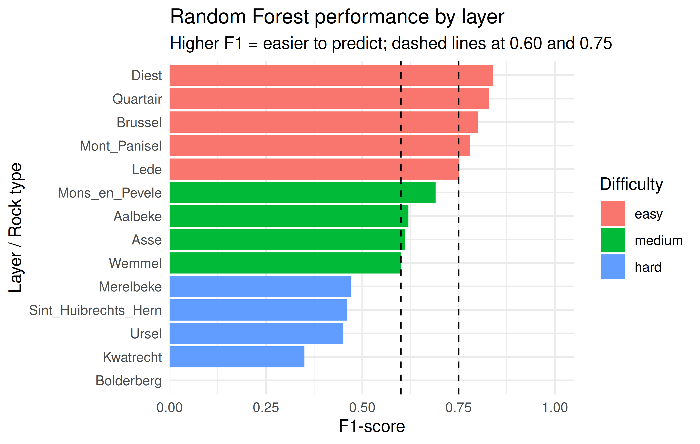
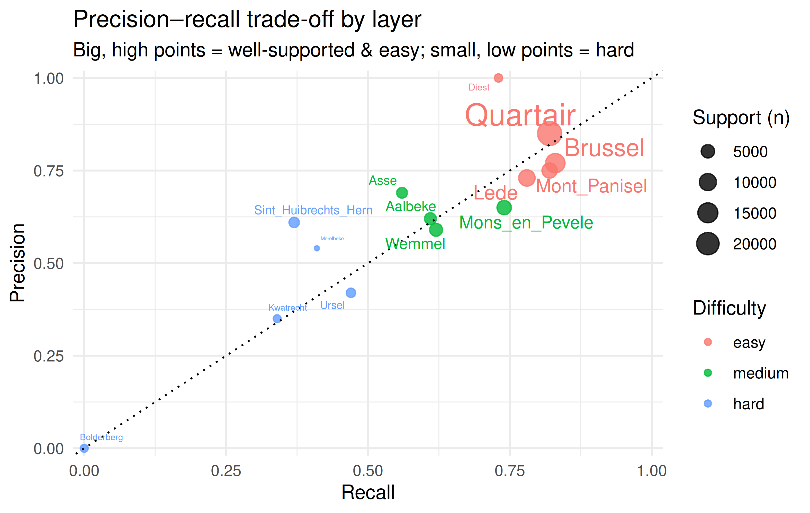
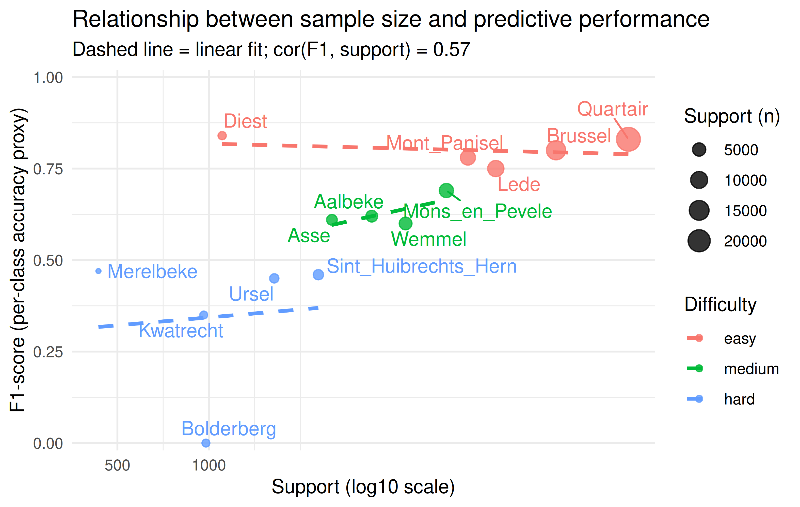
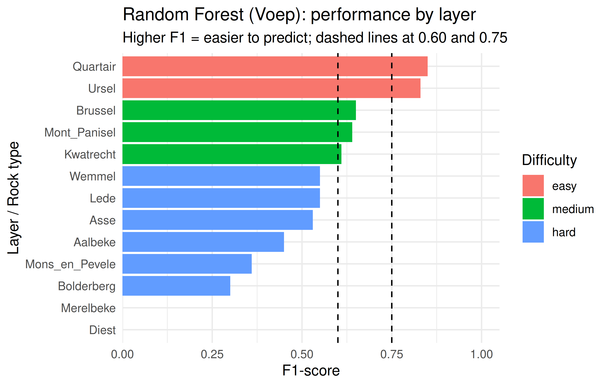
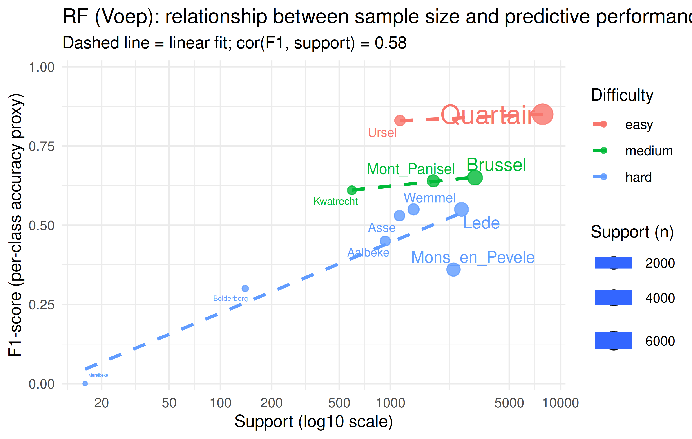
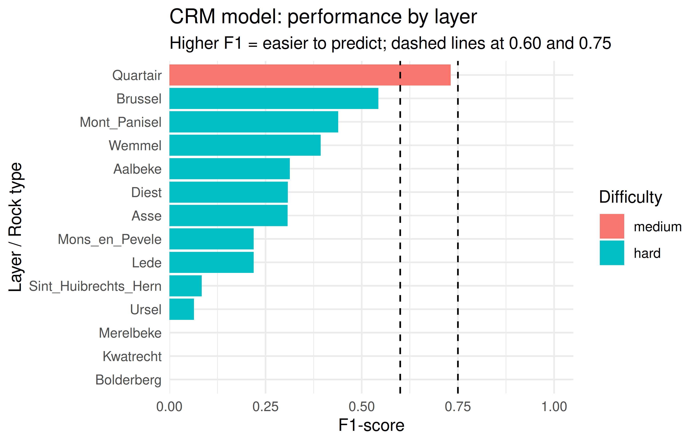
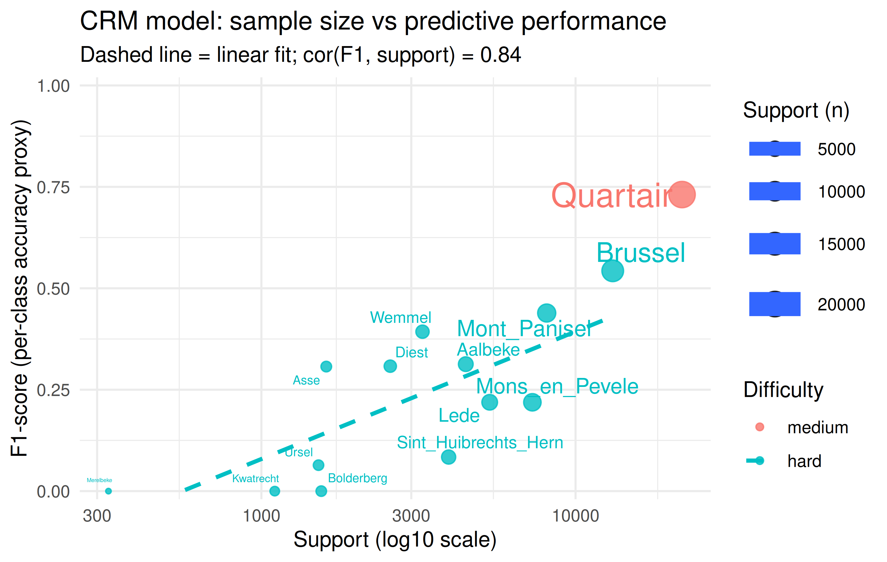

Model Results Analysis
================

### Binning model

``` r
library(dplyr)
```

    ## 
    ## Attaching package: 'dplyr'

    ## The following objects are masked from 'package:stats':
    ## 
    ##     filter, lag

    ## The following objects are masked from 'package:base':
    ## 
    ##     intersect, setdiff, setequal, union

``` r
library(ggplot2)
library(forcats)
library(ggrepel)  # for nicer text labels on the scatter plot

# -------------------------------------------------------------------
# 1. Enter the classification report as a data frame
# -------------------------------------------------------------------


metrics <-  tribble(
  ~layer,                 ~precision, ~recall, ~f1,   ~support,
  "Aalbeke",                 0.62,      0.61,   0.62,   3439,
  "Asse",                    0.69,      0.56,   0.61,   2542,
  "Bolderberg",              0.00,      0.00,   0.00,    978,
  "Brussel",                 0.77,      0.83,   0.80,  13906,
  "Diest",                   1.00,      0.73,   0.84,   1106,
  "Kwatrecht",               0.35,      0.34,   0.35,    962,
  "Lede",                    0.73,      0.78,   0.75,   8807,
  "Merelbeke",               0.54,      0.41,   0.47,    433,
  "Mons_en_Pevele",          0.65,      0.74,   0.69,   6055,
  "Mont_Panisel",            0.75,      0.82,   0.78,   7129,
  "Quartair",                0.85,      0.82,   0.83,  24071,
  "Sint_Huibrechts_Hern",    0.61,      0.37,   0.46,   2294,
  "Ursel",                   0.42,      0.47,   0.45,   1642,
  "Wemmel",                  0.59,      0.62,   0.60,   4444
)


# -------------------------------------------------------------------
# 2. Define “difficulty” based on F1 (you can tweak the cut–offs)
#    - easy   : F1 >= 0.75
#    - medium : 0.60 <= F1 < 0.75
#    - hard   : F1 < 0.60
# -------------------------------------------------------------------
metrics <- metrics %>%
  mutate(
    difficulty = case_when(
      f1 >= 0.75 ~ "easy",
      f1 >= 0.60 ~ "medium",
      TRUE       ~ "hard"
    ),
    difficulty = factor(difficulty, levels = c("easy", "medium", "hard")),
    # order layers by F1 so the plot reads from hardest (bottom) to easiest (top)
    layer = fct_reorder(layer, f1)
  )

# -------------------------------------------------------------------
# 3. Bar plot: which rocks are easy vs hard to predict?
# -------------------------------------------------------------------
p_f1 <- ggplot(metrics, aes(x = layer, y = f1, fill = difficulty)) +
  geom_col() +
  geom_hline(yintercept = 0.60, linetype = "dashed") +
  geom_hline(yintercept = 0.75, linetype = "dashed") +
  coord_flip() +
  scale_y_continuous(limits = c(0, 1), expand = expansion(mult = c(0, 0.05))) +
  labs(
    x = "Layer / Rock type",
    y = "F1-score",
    fill = "Difficulty",
    title = "Random Forest performance by layer",
    subtitle = "Higher F1 = easier to predict; dashed lines at 0.60 and 0.75"
  ) +
  theme_minimal()

p_f1
```

<!-- -->

``` r
p_pr <- ggplot(metrics,
               aes(x = recall, y = precision,
                   colour = difficulty, size = support, label = layer)) +
  geom_point(alpha = 0.8) +
  geom_abline(slope = 1, intercept = 0, linetype = "dotted") +
  ggrepel::geom_text_repel(show.legend = FALSE, max.overlaps = 100) +
  scale_x_continuous(limits = c(0, 1), expand = expansion(mult = 0.02)) +
  scale_y_continuous(limits = c(0, 1), expand = expansion(mult = 0.02)) +
  labs(
    x = "Recall",
    y = "Precision",
    colour = "Difficulty",
    size = "Support (n)",
    title = "Precision–recall trade-off by layer",
    subtitle = "Big, high points = well-supported & easy; small, low points = hard"
  ) +
  theme_minimal()

p_pr
```

<!-- -->

``` r
library(dplyr)
library(ggplot2)
library(ggrepel)

# 1. (Assumes 'metrics' already exists from previous code.)

# 2. Correlation between F1 ("accuracy") and sample size
cor_f1_support <- cor(metrics$f1, metrics$support)
cor_f1_support
```

    ## [1] 0.5713394

``` r
# You can report this number in the text, e.g.
# "Correlation between F1-score and support = ..."

# 3. Scatter plot: F1 vs support
p_f1_support <- ggplot(metrics,
                       aes(x = support, y = f1,
                           colour = difficulty, label = layer)) +
  geom_point(aes(size = support), alpha = 0.8) +
  geom_smooth(method = "lm", se = FALSE, linetype = "dashed") +
  ggrepel::geom_text_repel(show.legend = FALSE, max.overlaps = 100) +
  scale_x_continuous(trans = "log10",
                     breaks = c(10, 20, 50, 100, 200, 500, 1000)) +
  scale_y_continuous(limits = c(0, 1), expand = expansion(mult = 0.02)) +
  labs(
    x = "Support (log10 scale)",
    y = "F1-score (per-class accuracy proxy)",
    colour = "Difficulty",
    size = "Support (n)",
    title = "Relationship between sample size and predictive performance",
    subtitle = paste0("Dashed line = linear fit; cor(F1, support) = ",
                      round(cor_f1_support, 2))
  ) +
  theme_minimal()

p_f1_support
```

    ## `geom_smooth()` using formula = 'y ~ x'

    ## Warning: The following aesthetics were dropped during statistical transformation: label.
    ## ℹ This can happen when ggplot fails to infer the correct grouping structure in
    ##   the data.
    ## ℹ Did you forget to specify a `group` aesthetic or to convert a numerical
    ##   variable into a factor?

<!-- -->

### RF

``` r
# -------------------------------------------------------------------
# 1. Metrics table for RF on full Voep data
# -------------------------------------------------------------------
rf_voep <- tribble(
  ~layer,             ~precision, ~recall, ~f1,  ~support,
  "Aalbeke",              0.78,      0.31,  0.45,   933,
  "Asse",                 0.64,      0.45,  0.53,  1130,
  "Bolderberg",           0.25,      0.37,  0.30,   140,
  "Brussel",              0.67,      0.64,  0.65,  3142,
  "Diest",                0.00,      0.00,  0.00,     0,
  "Kwatrecht",            0.81,      0.49,  0.61,   593,
  "Lede",                 0.48,      0.64,  0.55,  2617,
  "Merelbeke",            0.00,      0.00,  0.00,    16,
  "Mons_en_Pevele",       0.70,      0.24,  0.36,  2348,
  "Mont_Panisel",         0.50,      0.91,  0.64,  1787,
  "Quartair",             0.83,      0.87,  0.85,  7854,
  "Ursel",                0.85,      0.80,  0.83,  1138,
  "Wemmel",               0.54,      0.57,  0.55,  1367
)

# -------------------------------------------------------------------
# 2. Difficulty labels and ordering by F1
# -------------------------------------------------------------------
rf_voep <- rf_voep %>%
  mutate(
    difficulty = case_when(
      f1 >= 0.75 ~ "easy",
      f1 >= 0.60 ~ "medium",
      TRUE       ~ "hard"
    ),
    difficulty = factor(difficulty, levels = c("easy", "medium", "hard")),
    layer = fct_reorder(layer, f1)  # order by F1
  )

# -------------------------------------------------------------------
# 3. Bar plot of F1 by layer (easy vs hard)
# -------------------------------------------------------------------
p_voep_f1 <- ggplot(rf_voep, aes(x = layer, y = f1, fill = difficulty)) +
  geom_col() +
  geom_hline(yintercept = 0.60, linetype = "dashed") +
  geom_hline(yintercept = 0.75, linetype = "dashed") +
  coord_flip() +
  scale_y_continuous(limits = c(0, 1), expand = expansion(mult = c(0, 0.05))) +
  labs(
    x = "Layer / Rock type",
    y = "F1-score",
    fill = "Difficulty",
    title = "Random Forest (Voep): performance by layer",
    subtitle = "Higher F1 = easier to predict; dashed lines at 0.60 and 0.75"
  ) +
  theme_minimal()

p_voep_f1
```

<!-- -->

``` r
# -------------------------------------------------------------------
# 4. F1 vs support (sample size) – correlation plot
#    Drop Diest (support = 0) for log10 scale
# -------------------------------------------------------------------
rf_voep_plot <- rf_voep %>% filter(support > 0)

cor_voep_f1_support <- cor(rf_voep_plot$f1, rf_voep_plot$support)

p_voep_f1_support <- ggplot(rf_voep_plot,
                            aes(x = support, y = f1,
                                colour = difficulty,
                                size = support,
                                label = layer)) +
  geom_point(alpha = 0.8) +
  geom_smooth(method = "lm", se = FALSE, linetype = "dashed") +
  ggrepel::geom_text_repel(show.legend = FALSE, max.overlaps = 100) +
  scale_x_continuous(trans = "log10",
                     breaks = c(10, 20, 50, 100, 200, 500, 1000, 5000, 10000)) +
  scale_y_continuous(limits = c(0, 1), expand = expansion(mult = 0.02)) +
  labs(
    x = "Support (log10 scale)",
    y = "F1-score (per-class accuracy proxy)",
    colour = "Difficulty",
    size = "Support (n)",
    title = "RF (Voep): relationship between sample size and predictive performance",
    subtitle = paste0("Dashed line = linear fit; cor(F1, support) = ",
                      round(cor_voep_f1_support, 2))
  ) +
  theme_minimal()

p_voep_f1_support
```

    ## Warning: Using `size` aesthetic for lines was deprecated in ggplot2 3.4.0.
    ## ℹ Please use `linewidth` instead.
    ## This warning is displayed once every 8 hours.
    ## Call `lifecycle::last_lifecycle_warnings()` to see where this warning was
    ## generated.

    ## `geom_smooth()` using formula = 'y ~ x'

    ## Warning: The following aesthetics were dropped during statistical transformation: size
    ## and label.
    ## ℹ This can happen when ggplot fails to infer the correct grouping structure in
    ##   the data.
    ## ℹ Did you forget to specify a `group` aesthetic or to convert a numerical
    ##   variable into a factor?

<!-- -->

### CRM model

``` r
# ----------------------------------------------------------
# 1. CRM model metrics table
# ----------------------------------------------------------
crm_model <- tribble(
  ~layer,                 ~precision, ~recall, ~f1,   ~support,
  "Aalbeke",                 0.380,    0.266,  0.313,   4473,
  "Asse",                    0.408,    0.245,  0.307,   1609,
  "Bolderberg",              0.000,    0.000,  0.000,   1551,
  "Brussel",                 0.553,    0.533,  0.543,  13133,
  "Diest",                   0.314,    0.302,  0.308,   2572,
  "Kwatrecht",               0.000,    0.000,  0.000,   1103,
  "Lede",                    0.218,    0.220,  0.219,   5330,
  "Merelbeke",               0.000,    0.000,  0.000,    326,
  "Mons_en_Pevele",          0.164,    0.328,  0.219,   7288,
  "Mont_Panisel",            0.429,    0.451,  0.439,   8095,
  "Quartair",                0.728,    0.734,  0.731,  21828,
  "Sint_Huibrechts_Hern",    0.103,    0.071,  0.084,   3945,
  "Ursel",                   0.245,    0.037,  0.064,   1520,
  "Wemmel",                  0.394,    0.392,  0.393,   3257
)

# ----------------------------------------------------------
# 2. Difficulty labels + ordering by F1
#    (same thresholds as before)
# ----------------------------------------------------------
crm_model <- crm_model %>%
  mutate(
    difficulty = case_when(
      f1 >= 0.75 ~ "easy",
      f1 >= 0.60 ~ "medium",
      TRUE       ~ "hard"
    ),
    difficulty = factor(difficulty, levels = c("easy", "medium", "hard")),
    layer = fct_reorder(layer, f1)   # order by F1
  )

# ----------------------------------------------------------
# 3. Bar plot: which layers are easy / hard for the CRM model?
# ----------------------------------------------------------
p_crm_f1 <- ggplot(crm_model, aes(x = layer, y = f1, fill = difficulty)) +
  geom_col() +
  geom_hline(yintercept = 0.60, linetype = "dashed") +
  geom_hline(yintercept = 0.75, linetype = "dashed") +
  coord_flip() +
  scale_y_continuous(limits = c(0, 1), expand = expansion(mult = c(0, 0.05))) +
  labs(
    x = "Layer / Rock type",
    y = "F1-score",
    fill = "Difficulty",
    title = "CRM model: performance by layer",
    subtitle = "Higher F1 = easier to predict; dashed lines at 0.60 and 0.75"
  ) +
  theme_minimal()

p_crm_f1
```

<!-- -->

``` r
# ----------------------------------------------------------
# 4. F1 vs support: does more data help the CRM model?
# ----------------------------------------------------------
cor_crm_f1_support <- cor(crm_model$f1, crm_model$support)

p_crm_f1_support <- ggplot(crm_model,
                           aes(x = support, y = f1,
                               colour = difficulty,
                               size = support,
                               label = layer)) +
  geom_point(alpha = 0.8) +
  geom_smooth(method = "lm", se = FALSE, linetype = "dashed") +
  ggrepel::geom_text_repel(show.legend = FALSE, max.overlaps = 100) +
  scale_x_continuous(
    trans = "log10",
    breaks = c(100, 300, 1000, 3000, 10000, 30000)
  ) +
  scale_y_continuous(limits = c(0, 1), expand = expansion(mult = 0.02)) +
  labs(
    x = "Support (log10 scale)",
    y = "F1-score (per-class accuracy proxy)",
    colour = "Difficulty",
    size   = "Support (n)",
    title = "CRM model: sample size vs predictive performance",
    subtitle = paste0("Dashed line = linear fit; cor(F1, support) = ",
                      round(cor_crm_f1_support, 2))
  ) +
  theme_minimal()

p_crm_f1_support
```

    ## `geom_smooth()` using formula = 'y ~ x'

    ## Warning: The following aesthetics were dropped during statistical transformation: size
    ## and label.
    ## ℹ This can happen when ggplot fails to infer the correct grouping structure in
    ##   the data.
    ## ℹ Did you forget to specify a `group` aesthetic or to convert a numerical
    ##   variable into a factor?

    ## Warning: Removed 12 rows containing missing values or values outside the scale range
    ## (`geom_smooth()`).

<!-- -->

### Hybrid tile-based knn + features model

``` r
# ----------------------------------------------------------
# 1. Hybrid model metrics table
# ----------------------------------------------------------

crm_model <- tribble(
  ~layer,                 ~accuracy,
  "Aalbeke",                 0.786,
  "Asse",                    1.000,
  "Bolderberg",              0.000,
  "Brussel",                 0.727,
  "Kwatrecht",               0.333,
  "Lede",                    0.750,
  "Merelbeke",               0.000,
  "Mons_en_Pevele",          0.846,
  "Mont_Panisel",            0.706,
  "Quartair",                0.875,
  "Ursel",                   0.667,
  "Wemmel",                  0.889,
)

# ----------------------------------------------------------
# 2. Train and test split
# ----------------------------------------------------------

**Train/test split**  
The dataset is partitioned into a 5×5 grid over the (x, y) coordinates. A tile-based split is used to reduce spatial leakage:  
 - **70 %** of the tiles are used for training,  
 - **30 %** for testing.  
For comparability with earlier work, the script can also reconstruct the historic JSON-based split, but the hybrid model is trained on the tile split.

# ----------------------------------------------------------
# 3. Feature selection procedure and final set
# ----------------------------------------------------------

**Final feature set**  
The Python model reuses the engineered features from the CPT feature table and, after a two-step feature selection procedure, fixes five features as input for the hybrid kNN.
In the first step, we computed an ANOVA F-statistic for each numeric candidate feature on the tile-training set (68 candidate features) and ranked them by decreasing F-value. In the second step, we iteratively added features in that order while excluding any feature whose absolute Pearson correlation with already selected features exceeded 0.95 (|r| ≥ 0.95), stopping once at most five features were retained (max_features = 5 based on LOOCV). Thus, we obtained the following final feature set:
  
 - `icn_sq_mean`  
 - `log_qc_mean`  
 - `rf_top3_mean_depth_rel`  
 - `qtn_top3_mean_depth_rel`  
 - `rf_mean`  

These features encode cone resistance, friction ratio and normalized depth information and were chosen in an earlier LOOCV run as a compromise between discriminability and redundancy.

# ----------------------------------------------------------
# 4. Inverse distance weighting
# ----------------------------------------------------------

**Distance definition**  
 For every query row, the model computes:
  
 - a **spatial distance** in standardized x–y space,  
 - an **elevation distance** around the row’s mean depth relative to mean sea level (`mean_depth_mtaw`) using a window of width τ,  
 - a **feature distance** in z-scored feature space for the five selected features.

The combined distance for neighbor search is

\[
d_\text{combo} = \sqrt{\alpha\, d_\text{spatial}^2 + \beta\, d_\text{feat}^2},
\]

where α controls the weight of spatial proximity and β the weight of feature similarity.

# ----------------------------------------------------------
# 5. Hyperparameters after LOOCV hyperparameter tuning
# ----------------------------------------------------------

**Final hyperparameters used for the report**  

The hyperparameters were tuned with LOOCV (where one tile was left out) and yielded these results:

 | Component                    | Value        |
 |------------------------------|-------------:|
 | Model type                   | row-based hybrid knn (as opposed to cpt-based hybrid knn) |
 | Number of neighbours \(k\)   | 3            |
 | Elevation window τ starts at | 20.0         |
 | Spatial weight α             | 2.5          |
 | Feature weight β             | 2.0          |

# ----------------------------------------------------------
# 6. Model eval and post-processing
# ----------------------------------------------------------

Evaluation and post-processing

**Tile-based test accuracy (before post-processing)**  
On the tile-based test set, the hybrid kNN model achieves an overall accuracy of **74%** before stratigraphic post-processing.

**JSON-based test accuracy (common test and train split)**  
For comparability with earlier models, the same tile-trained hybrid model is also evaluated on the JSON-based test split. On this split, the model achieves an overall accuracy of **90%** before post-processing.

**Stratigraphic post-processing**  
To enforce a realistic stratigraphic ordering along each CPT, the Python model performs one post-processing step:

 - For each CPT, rows are sorted from top to bottom by `mean_depth_mtaw`.  
 - For each row, the algorithm starts from the best predicted label and only accepts labels that are consistent with the fixed segment order.  
 - If the best label violates this order, the algorithm first tries the second-best label; if that also violates the order, it falls back to the previous accepted label along the CPT.

This procedure changes the predicted label for **19** rows. After post-processing, the overall accuracy on the tile-based test set increases to **66%**.

Overall, the hybrid knn model

- offers a geospatial baseline that works on tile-based splits to reduce spatial leakage,  
- uses a compact set of five CPT-based features instead of the full feature table, and  
- enforces a segment order along each CPT while providing an accuracy estimate of the post-processed result.
